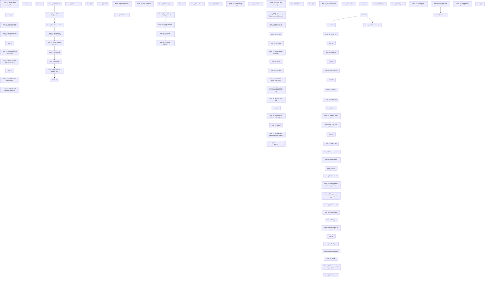

# Ionia/Wenger Sanatorium/Reception/Reception (E)

```mermaid
graph TD
    65_0["Actor_-1"]
    65_19["Actor_-1"]
    65_26["Actor_-1"]
    65_29["Actor_-1: NCAnd here I was thinking we had something special..."]
    65_30["Actor_-1"]
    65_31["Actor_-1: pic=6Then again, I don't mind being used."]
    65_32["Actor_-1: NSCAs long as I get to use you, too."]
    65_33["Actor_-1"]
    65_34["Actor_-1: pic=6But before that happens..."]
    65_36["Actor_-1: NSCLet's see what we can find out!"]
    65_40["Actor_-1: RCUntil one of us gets bored."]
    65_41["Actor_-1: RAnd the other one is left in tears."]
    65_42["Actor_-1"]
    65_75["Actor_7: Who are you?"]
    65_80["Actor_20"]
    65_83["Actor_9"]
    65_86["Actor_-1: NSC"]
    65_88["Actor_-1: NSCLorna."]
    65_90["Actor_-1: NSCVicky!"]
    65_91["Actor_-1: pic=10Take a look at th-"]
    65_92["Actor_-1: pic=6It's adorable."]
    65_93["Actor_-1: NSCBut we wanted to unpack, right?"]
    65_94["Actor_-1: NSCI'll be there in a sec-"]
    65_95["Actor_-1: pic=10Now."]
    65_96["Actor_16: NSCI'll be there in a sec-"]
    65_97["Actor_-1: NCAlright."]
    65_98["Actor_-1: NSCPleasure meeting you!"]
    65_102["Actor_-1: pic=6She's very excited about "]
    65_104["Actor_-1"]
    65_110["Actor_-1: Over there?"]
    65_146["Actor_-1"]
    65_151["Actor_23: NSCYeah."]
    65_156["Actor_16: NSCWere you out here all by yourself?"]
    65_159["Actor_16: NCDamn."]
    65_160["Actor_23: NCIt's alright."]
    65_161["Actor_16: NCDamn."]
    65_162["Actor_23: pic=6I'll keep looking."]
    65_163["Actor_23: NSCWhat about you?"]
    65_166["Actor_16: NCSimilar situation."]
    65_167["Actor_16: NCSimilar situation."]
    65_168["Actor_16"]
    65_172["Actor_23: NCYou could say that, yeah."]
    65_174["Actor_16: pic=6Hm."]
    65_179["Actor_40"]
    65_181["Actor_16: NSCDo you know your way around here?"]
    65_182["Actor_23: pic=6Considering you had to bail me out a minute ago."]
    65_183["Actor_23: NSCI think we should ask someone else."]
    65_184["Actor_16: NCYeah."]
    65_185["Actor_16: But where?"]
    65_186["Actor_23: NSCShould get us straight to the northern gate."]
    65_187["Actor_16: NCYeah, about that."]
    65_190["Actor_16: I don't think it's much of a bridge anymore."]
    65_191["Actor_23: Really?"]
    65_192["Actor_23: NCI guess that explains the bang I heard."]
    65_193["Actor_16: Is there another way in?"]
    65_205["Actor_23: NSCCity would be a start."]
    65_207["Actor_23: pic=6There's a bridge down south."]
    65_209["Actor_16"]
    65_210["Actor_27: NSCYeah."]
    65_259["Actor_16: A city?"]
    65_260["Actor_23: NGDYeah!"]
    65_261["Actor_16: NCI guess."]
    65_262["Actor_10"]
    65_267["Actor_23: How does it make you feel?"]
    65_279["Actor_23: Everybody has their own medicine."]
    65_280["Actor_23: And she's not seeing you right now."]
    65_281["Actor_16: I guess."]
    65_307["Actor_16"]
    65_308["Actor_10: Excuse me?"]
    65_309["Actor_40: There it is!"]
    65_310["Actor_40"]
    65_311["Actor_40: Just a second!"]
    65_312["Actor_40"]
    65_313["Actor_40: Daphne?"]
    65_314["Actor_40: Is that you?"]
    65_315["Actor_10: Yup."]
    65_316["Actor_40: That time of the year?"]
    65_317["Actor_10: NCTime flies, doesn't it?"]
    65_318["Actor_10"]
    65_319["Actor_10: How is he?"]
    65_320["Actor_40: The usual, I think."]
    65_321["Actor_40: You're here to see him?"]
    65_322["Actor_10: Yeah."]
    65_323["Actor_40: Understood."]
    65_324["Actor_40: He's in the west wing, down the hall to your left."]
    65_326["Actor_40: Do you want someone to accompany you?"]
    65_327["Actor_10: NCNo need."]
    65_328["Actor_10: I'll find my way."]
    65_329["Actor_40: Okay."]
    65_330["Actor_40: Would you be so kind and sign right here?"]
    65_331["Actor_40"]
    65_332["Actor_40: Thank you."]
    65_333["Actor_40: Was nice seeing you again!"]
    65_334["Actor_10: NSLikewise!"]
    65_335["Actor_40: Stay safe, okay?"]
    65_336["Actor_40: Here's your pass."]
    65_337["Actor_10: Thanks."]
    65_0 --> 65_83
    65_29 --> 65_30
    65_30 --> 65_31
    65_31 --> 65_32
    65_32 --> 65_33
    65_33 --> 65_40
    65_34 --> 65_36
    65_40 --> 65_41
    65_41 --> 65_42
    65_42 --> 65_34
    65_83 --> 65_179
    65_83 --> 65_335
    65_90 --> 65_91
    65_91 --> 65_92
    65_92 --> 65_93
    65_93 --> 65_94
    65_94 --> 65_95
    65_95 --> 65_97
    65_97 --> 65_98
    65_98 --> 65_146
    65_102 --> 65_88
    65_160 --> 65_162
    65_162 --> 65_163
    65_163 --> 65_166
    65_166 --> 65_167
    65_179 --> 65_308
    65_181 --> 65_182
    65_182 --> 65_183
    65_183 --> 65_184
    65_184 --> 65_185
    65_185 --> 65_205
    65_186 --> 65_187
    65_187 --> 65_209
    65_190 --> 65_191
    65_191 --> 65_192
    65_192 --> 65_193
    65_205 --> 65_259
    65_207 --> 65_186
    65_209 --> 65_190
    65_259 --> 65_260
    65_260 --> 65_207
    65_262 --> 65_309
    65_279 --> 65_281
    65_308 --> 65_262
    65_309 --> 65_310
    65_310 --> 65_311
    65_311 --> 65_312
    65_312 --> 65_313
    65_313 --> 65_314
    65_314 --> 65_315
    65_315 --> 65_316
    65_316 --> 65_317
    65_317 --> 65_318
    65_318 --> 65_319
    65_319 --> 65_320
    65_320 --> 65_321
    65_321 --> 65_322
    65_322 --> 65_323
    65_323 --> 65_324
    65_324 --> 65_326
    65_326 --> 65_327
    65_327 --> 65_328
    65_328 --> 65_329
    65_329 --> 65_330
    65_330 --> 65_331
    65_331 --> 65_332
    65_332 --> 65_336
    65_333 --> 65_334
    65_336 --> 65_337
    65_337 --> 65_333
```