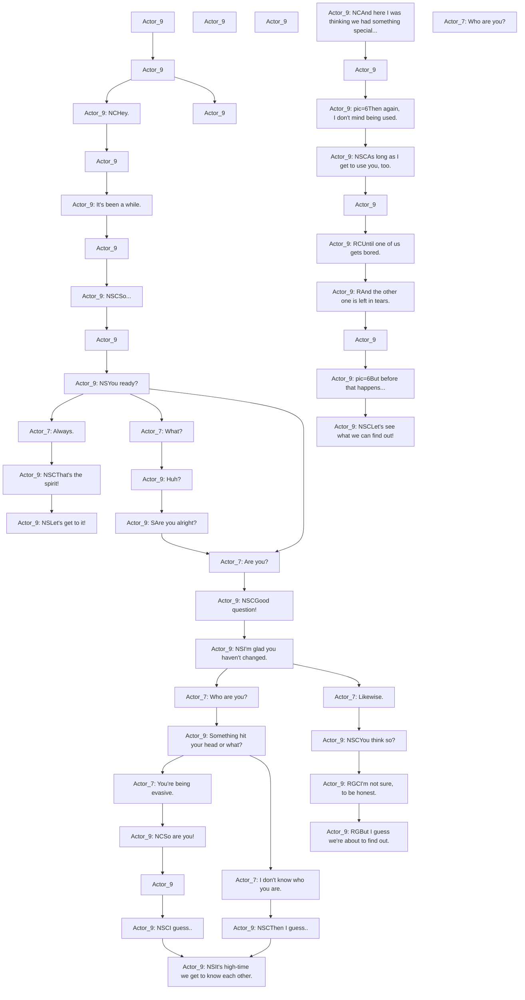

# Ionia/Wenger Sanatorium/West/W2

```mermaid
graph TD
    2_0["Actor_9"]
    2_1["Actor_9: NCHey."]
    2_2["Actor_9"]
    2_3["Actor_9: It's been a while."]
    2_4["Actor_9"]
    2_5["Actor_9"]
    2_6["Actor_9: NSCSo..."]
    2_7["Actor_9: NSYou ready?"]
    2_10["Actor_7: Always."]
    2_11["Actor_7: What?"]
    2_12["Actor_7: Are you?"]
    2_13["Actor_9: NSCThat's the spirit!"]
    2_14["Actor_9: Huh?"]
    2_16["Actor_9: NSLet's get to it!"]
    2_17["Actor_9: SAre you alright?"]
    2_19["Actor_9"]
    2_20["Actor_9: NSCGood question!"]
    2_21["Actor_9: NSI'm glad you haven't changed."]
    2_23["Actor_7: Who are you?"]
    2_24["Actor_7: Likewise."]
    2_25["Actor_9: Something hit your head or what?"]
    2_26["Actor_9"]
    2_29["Actor_9: NCAnd here I was thinking we had something special..."]
    2_30["Actor_9"]
    2_31["Actor_9: pic=6Then again, I don't mind being used."]
    2_32["Actor_9: NSCAs long as I get to use you, too."]
    2_33["Actor_9"]
    2_34["Actor_9: pic=6But before that happens..."]
    2_36["Actor_9: NSCLet's see what we can find out!"]
    2_37["Actor_9: NSCYou think so?"]
    2_38["Actor_9: RGCI'm not sure, to be honest."]
    2_39["Actor_9: RGBut I guess we're about to find out."]
    2_40["Actor_9: RCUntil one of us gets bored."]
    2_41["Actor_9: RAnd the other one is left in tears."]
    2_42["Actor_9"]
    2_70["Actor_9"]
    2_71["Actor_9"]
    2_72["Actor_7: I don't know who you are."]
    2_73["Actor_9: NSCThen I guess.."]
    2_74["Actor_9: NSIt's high-time we get to know each other."]
    2_75["Actor_7: Who are you?"]
    2_76["Actor_7: You're being evasive."]
    2_77["Actor_9: NCSo are you!"]
    2_78["Actor_9: NSCI guess.."]
    2_79["Actor_9"]
    2_0 --> 2_4
    2_1 --> 2_5
    2_2 --> 2_6
    2_3 --> 2_2
    2_4 --> 2_1
    2_4 --> 2_70
    2_5 --> 2_3
    2_6 --> 2_71
    2_7 --> 2_10
    2_7 --> 2_11
    2_7 --> 2_12
    2_10 --> 2_13
    2_11 --> 2_14
    2_12 --> 2_20
    2_13 --> 2_16
    2_14 --> 2_17
    2_17 --> 2_12
    2_20 --> 2_21
    2_21 --> 2_23
    2_21 --> 2_24
    2_23 --> 2_25
    2_24 --> 2_37
    2_25 --> 2_76
    2_25 --> 2_72
    2_29 --> 2_30
    2_30 --> 2_31
    2_31 --> 2_32
    2_32 --> 2_33
    2_33 --> 2_40
    2_34 --> 2_36
    2_37 --> 2_38
    2_38 --> 2_39
    2_40 --> 2_41
    2_41 --> 2_42
    2_42 --> 2_34
    2_71 --> 2_7
    2_72 --> 2_73
    2_73 --> 2_74
    2_76 --> 2_77
    2_77 --> 2_79
    2_78 --> 2_74
    2_79 --> 2_78
```