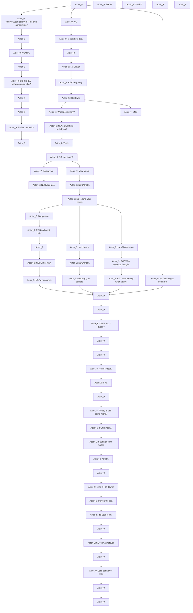

# Ionia/Wenger Sanatorium/West/W2/Books

```mermaid
graph TD
    4_0["Actor_9"]
    4_6["Actor_9: 'color=811e1eIcolor=FFFFFFonia, a manifesto.'"]
    4_8["Actor_9: SIs this guy showing up or what?"]
    4_11["Actor_9"]
    4_12["Actor_9: NCMan."]
    4_13["Actor_9"]
    4_14["Actor_9: SHm?"]
    4_15["Actor_9"]
    4_16["Actor_9: SWhat the fuck?"]
    4_17["Actor_9"]
    4_18["Actor_9: NC "]
    4_19["Actor_9: Is that how it is?"]
    4_20["Actor_9"]
    4_21["Actor_9: NCClever."]
    4_22["Actor_9: RGCVery, very."]
    4_23["Actor_9: RGClever."]
    4_24["Actor_9: NSCNothing to see here."]
    4_27["Actor_9"]
    4_29["Actor_9: SHuh?"]
    4_30["Actor_9"]
    4_31["Actor_9: Come in... I guess?"]
    4_32["Actor_9"]
    4_33["Actor_8: Hello Timotej."]
    4_34["Actor_9: SYo."]
    4_35["Actor_9"]
    4_37["Actor_8: Ready to talk some more?"]
    4_38["Actor_9: SCNot really."]
    4_40["Actor_9: SBut it doesn't matter."]
    4_42["Actor_8: Alright."]
    4_43["Actor_9"]
    4_44["Actor_8: Mind if I sit down?"]
    4_46["Actor_9: It's your house."]
    4_47["Actor_8: It's your room."]
    4_48["Actor_9"]
    4_49["Actor_9: SCYeah, whatever."]
    4_50["Actor_9"]
    4_51["Actor_9: Let's get it over with."]
    4_53["Actor_9"]
    4_54["Actor_9"]
    4_55["Actor_9"]
    4_56["Actor_9"]
    4_57["Actor_8"]
    4_58["Actor_7: END"]
    4_59["Actor_7: What does it say?"]
    4_60["Actor_9: NSYou want me to tell you?"]
    4_61["Actor_9: NSHow much?"]
    4_62["Actor_7: Yeah."]
    4_63["Actor_7: Screw you."]
    4_64["Actor_9: NSCYour loss."]
    4_65["Actor_7: Very much."]
    4_66["Actor_9: NSCAlright."]
    4_67["Actor_9: NSTell me your name."]
    4_68["Actor_7: Ganymede."]
    4_69["Actor_9: RGSmall word, huh?"]
    4_70["Actor_7: No chance."]
    4_71["Actor_7: var=PlayerName"]
    4_72["Actor_9: NSCEither way."]
    4_73["Actor_9: NSI'm honoured."]
    4_74["Actor_9"]
    4_75["Actor_9: RGCWho would've thought."]
    4_76["Actor_9: RGThat's exactly what it says!"]
    4_77["Actor_9: NSCAlright."]
    4_78["Actor_9: NSKeep your secrets."]
    4_79["Actor_9"]
    4_0 --> 4_6
    4_0 --> 4_18
    4_0 --> 4_24
    4_6 --> 4_11
    4_8 --> 4_13
    4_11 --> 4_12
    4_12 --> 4_56
    4_13 --> 4_15
    4_15 --> 4_16
    4_16 --> 4_17
    4_18 --> 4_19
    4_19 --> 4_20
    4_20 --> 4_21
    4_21 --> 4_22
    4_22 --> 4_23
    4_23 --> 4_59
    4_23 --> 4_58
    4_24 --> 4_27
    4_27 --> 4_30
    4_30 --> 4_31
    4_31 --> 4_32
    4_32 --> 4_57
    4_33 --> 4_34
    4_34 --> 4_35
    4_35 --> 4_37
    4_37 --> 4_38
    4_38 --> 4_40
    4_40 --> 4_42
    4_42 --> 4_43
    4_43 --> 4_44
    4_44 --> 4_46
    4_46 --> 4_47
    4_47 --> 4_48
    4_48 --> 4_49
    4_49 --> 4_50
    4_50 --> 4_51
    4_51 --> 4_53
    4_53 --> 4_79
    4_56 --> 4_8
    4_57 --> 4_33
    4_59 --> 4_60
    4_60 --> 4_62
    4_61 --> 4_63
    4_61 --> 4_65
    4_62 --> 4_61
    4_63 --> 4_64
    4_65 --> 4_66
    4_66 --> 4_67
    4_67 --> 4_68
    4_67 --> 4_70
    4_67 --> 4_71
    4_68 --> 4_69
    4_69 --> 4_74
    4_70 --> 4_77
    4_71 --> 4_75
    4_72 --> 4_73
    4_73 --> 4_27
    4_74 --> 4_72
    4_75 --> 4_76
    4_76 --> 4_27
    4_77 --> 4_78
    4_78 --> 4_27
```