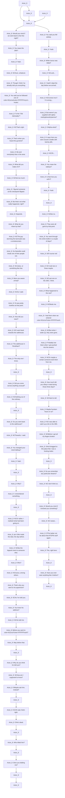

# Ionia/Wenger Sanatorium/West/W2/Therapy

```mermaid
graph TD
    13_0["Actor_9"]
    13_1["Actor_8"]
    13_2["Actor_8: Would you mind if we went back to the first night?"]
    13_3["Actor_9: You mean the 26th?"]
    13_4["Actor_8: Yeah."]
    13_5["Actor_9: NCSure, whatever."]
    13_6["Actor_9: Though I think I’ve already told you everything."]
    13_7["Actor_8: You said you've followed one of color=811e1eAcolor=FFFFFFmryn’s 'mules'."]
    13_8["Actor_8: To the “Old Admirality”?"]
    13_9["Actor_9: NCThat's right."]
    13_10["Actor_8: That’s when you heard the gunshot?"]
    13_11["Actor_9: Me and everybody else in the area."]
    13_12["Actor_8: What did you make of it?"]
    13_13["Actor_9: NCNot too much."]
    13_14["Actor_9: I figured someone at the checkpoint flipped."]
    13_15["Actor_8: But that’s not what really happened, right?"]
    13_16["Actor_9: Depends."]
    13_17["Actor_8: What do you mean by that?"]
    13_18["Actor_9: NCThe guy storming the barricade was a smokescreen."]
    13_19["Actor_9: So Nestville could break one of their people out."]
    13_20["Actor_9: NCJulius, or something like that."]
    13_21["Actor_8: Were you aware of that?"]
    13_22["Actor_9: SCAs I said."]
    13_23["Actor_9: SI was pretty clueless at that point."]
    13_24["Actor_9: NCI went back towards the safehouse."]
    13_25["Actor_8: The safehouse in Rondham?"]
    13_26["Actor_9: The only one I know."]
    13_27["Actor_9"]
    13_30["Actor_8: Did you come across anything unusual?"]
    13_31["Actor_9: NCNothing out of the ordinary."]
    13_32["Actor_9"]
    13_33["Actor_8: So you went back to the safehouse?"]
    13_34["Actor_9: NCTowards, I said."]
    13_35["Actor_8: You changed your mind halfway?"]
    13_36["Actor_9: Yeah."]
    13_37["Actor_9"]
    13_38["Actor_8: Why?"]
    13_39["Actor_9: I remembered something."]
    13_40["Actor_9"]
    13_41["Actor_9: NCOr rather, I realised what had been going on."]
    13_42["Actor_9: pic=1We made the deal, the day before."]
    13_43["Actor_9: NCBut the legwork went to someone else."]
    13_45["Actor_8: Who?"]
    13_46["Actor_9: NCIcarus, among others."]
    13_47["Actor_8: That's why you went to his apartment?"]
    13_48["Actor_9: SCAs I've told you."]
    13_49["Actor_8: You knew his address?"]
    13_50["Actor_9: NCHe told me."]
    13_51["Actor_8: Before you went to color=811e1eTcolor=FFFFFFrachi?"]
    13_52["Actor_9: Way before that."]
    13_53["Actor_9"]
    13_54["Actor_8: Why do you think he told you?"]
    13_55["Actor_9: SCHow am I supposed to know?"]
    13_57["Actor_9: SMaybe ask him, instead?"]
    13_58["Actor_9: SCOh wait, that's right."]
    13_59["Actor_9"]
    13_60["Actor_9: SHe's dead."]
    13_61["Actor_9"]
    13_62["Actor_8: Who killed him?"]
    13_63["Actor_8"]
    13_64["Actor_9: SAre you kidding me?"]
    13_65["Actor_9"]
    13_66["Actor_8: You said you fell asleep."]
    13_67["Actor_9: Yeah."]
    13_68["Actor_8: While Icarus was killed?"]
    13_69["Actor_9: NCLook..."]
    13_70["Actor_9: I hadn’t slept the day before we arrived."]
    13_75["Actor_8: NCCorrect me if I’m wrong…"]
    13_76["Actor_8: But weren’t you supplied with alpha-methylphenethylamine?"]
    13_77["Actor_9: SAlpha-what?"]
    13_78["Actor_8: It says here you were issued a bottle with twenty pills."]
    13_79["Actor_9: NCOh..."]
    13_80["Actor_9: You mean the wakeys?"]
    13_81["Actor_8: Is that how you call it?"]
    13_82["Actor_9: Yeah."]
    13_83["Actor_9"]
    13_84["Actor_9: NCBut no."]
    13_85["Actor_9: They were all gone by that point."]
    13_86["Actor_8: You went through the entire bottle in a couple of days?"]
    13_87["Actor_9: SOf course not!"]
    13_88["Actor_9: SCI took two or three maybe."]
    13_89["Actor_9: NCLast one on the 25th, I think."]
    13_90["Actor_8: What happened to the rest?"]
    13_91["Actor_9: NCBeats me."]
    13_92["Actor_9: I had them when we entered color=811e1eTcolor=FFFFFFrachi."]
    13_93["Actor_9: NCBut when I woke up, they were gone."]
    13_94["Actor_9: Probably lost them when I got pushed into the sewers."]
    13_95["Actor_9: NCOr maybe a certain someone took them from me."]
    13_96["Actor_9"]
    13_97["Actor_8: How much did you sleep in total during those three days?"]
    13_98["Actor_9: NCHard to tell."]
    13_99["Actor_9: Maybe fourteen hours or so?"]
    13_100["Actor_9: NCI was able to catch up a bit on the 28th."]
    13_101["Actor_9: SCBefore I got all my fingers broken."]
    13_102["Actor_9: SAnd dragged to this place like I was a fucking traitor."]
    13_103["Actor_9"]
    13_104["Actor_8: Do you remember any particular dreams?"]
    13_105["Actor_9: NCI don't think so."]
    13_106["Actor_9"]
    13_107["Actor_8: Would you mind if I showed you something?"]
    13_108["Actor_9: SCI swear..."]
    13_109["Actor_9: SThis better not be about that ATOPIA stuff again-"]
    13_110["Actor_8: This, right here."]
    13_111["Actor_8"]
    13_112["Actor_8: Have you ever seen anything like it before?"]
    13_113["Actor_8"]
    13_115["Actor_8: How did you react?"]
    13_116["Actor_9"]
    13_117["Actor_9"]
    13_118["Actor_9"]
    13_0 --> 13_1
    13_0 --> 13_116
    13_1 --> 13_2
    13_1 --> 13_66
    13_2 --> 13_3
    13_3 --> 13_4
    13_4 --> 13_5
    13_5 --> 13_6
    13_6 --> 13_7
    13_7 --> 13_8
    13_8 --> 13_9
    13_9 --> 13_10
    13_10 --> 13_11
    13_11 --> 13_12
    13_12 --> 13_13
    13_13 --> 13_14
    13_14 --> 13_15
    13_15 --> 13_16
    13_16 --> 13_17
    13_17 --> 13_18
    13_18 --> 13_19
    13_19 --> 13_20
    13_20 --> 13_21
    13_21 --> 13_22
    13_22 --> 13_23
    13_23 --> 13_115
    13_24 --> 13_25
    13_25 --> 13_26
    13_26 --> 13_27
    13_27 --> 13_30
    13_30 --> 13_31
    13_31 --> 13_32
    13_32 --> 13_33
    13_33 --> 13_34
    13_34 --> 13_35
    13_35 --> 13_36
    13_36 --> 13_37
    13_37 --> 13_38
    13_38 --> 13_39
    13_39 --> 13_40
    13_40 --> 13_41
    13_41 --> 13_42
    13_42 --> 13_43
    13_43 --> 13_45
    13_45 --> 13_46
    13_46 --> 13_47
    13_47 --> 13_48
    13_48 --> 13_49
    13_49 --> 13_50
    13_50 --> 13_51
    13_51 --> 13_52
    13_52 --> 13_53
    13_53 --> 13_54
    13_54 --> 13_55
    13_55 --> 13_57
    13_57 --> 13_59
    13_58 --> 13_60
    13_59 --> 13_58
    13_60 --> 13_61
    13_61 --> 13_62
    13_62 --> 13_63
    13_63 --> 13_64
    13_64 --> 13_65
    13_65 --> 13_118
    13_66 --> 13_67
    13_67 --> 13_68
    13_68 --> 13_69
    13_69 --> 13_70
    13_70 --> 13_75
    13_75 --> 13_76
    13_76 --> 13_77
    13_77 --> 13_78
    13_78 --> 13_79
    13_79 --> 13_80
    13_80 --> 13_81
    13_81 --> 13_82
    13_82 --> 13_83
    13_83 --> 13_84
    13_84 --> 13_85
    13_85 --> 13_86
    13_86 --> 13_87
    13_87 --> 13_88
    13_88 --> 13_89
    13_89 --> 13_90
    13_90 --> 13_91
    13_91 --> 13_92
    13_92 --> 13_93
    13_93 --> 13_94
    13_94 --> 13_95
    13_95 --> 13_96
    13_96 --> 13_97
    13_97 --> 13_98
    13_98 --> 13_99
    13_99 --> 13_100
    13_100 --> 13_101
    13_101 --> 13_102
    13_102 --> 13_103
    13_103 --> 13_104
    13_104 --> 13_105
    13_105 --> 13_106
    13_106 --> 13_107
    13_107 --> 13_108
    13_108 --> 13_109
    13_109 --> 13_110
    13_110 --> 13_111
    13_111 --> 13_112
    13_112 --> 13_113
    13_115 --> 13_24
    13_116 --> 13_1
    13_117 --> 13_1
```