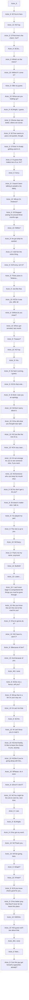

# Ionia/Wenger Sanatorium/West/W3/1926

```mermaid
graph TD
    500_0["Actor_9"]
    500_1["Actor_9: SCYou're here."]
    500_2["Actor_10: NCYup."]
    500_3["Actor_9: SThird time's the charm, huh?"]
    500_4["Actor_9: SCSo..."]
    500_5["Actor_9: What's on the menu?"]
    500_6["Actor_10: NMind if I come in?"]
    500_7["Actor_9: SBe my guest."]
    500_8["Actor_10: NHow are you holding up?"]
    500_9["Actor_9: SCAlright, I guess."]
    500_10["Actor_9: SSome days are better, others are worse."]
    500_11["Actor_9: SCTime seems to pass a lot quicker, though."]
    500_12["Actor_9: SThink I'm finally getting used to it."]
    500_13["Actor_9: SI guess that makes two of us, hm?"]
    500_14["Actor_9: Sorry."]
    500_15["Actor_9: I haven't been talking to people a lot, lately."]
    500_16["Actor_10: NEven Dr. Andreos?"]
    500_17["Actor_9: SCStopped seeing me around three months ago."]
    500_18["Actor_10: NWhy?"]
    500_19["Actor_9: He got what he wanted."]
    500_20["Actor_9: I told him the entire thing."]
    500_21["Actor_9: SCFunny, isn't it?"]
    500_22["Actor_9: Three years in Tartarus..."]
    500_23["Actor_9: Just like that."]
    500_24["Actor_10: NCSo it was you, after all."]
    500_25["Actor_9: SWhat do you mean?"]
    500_26["Actor_10: NFero got arrested, last month."]
    500_27["Actor_9: Treason?"]
    500_28["Actor_10: NCYup."]
    500_29["Actor_9: Hm."]
    500_30["Actor_9: He had it coming, I guess."]
    500_31["Actor_9: SCOn that note..."]
    500_32["Actor_9: SI think I owe you an apology."]
    500_33["Actor_10: NCDon't worry about it."]
    500_34["Actor_10: NYou did what you thought was right."]
    500_35["Actor_10: NCJust like the rest of us."]
    500_36["Actor_10: NCIn any case..."]
    500_37["Actor_10: NI can arrange for you to see someone else, if you want."]
    500_38["Actor_10: NCSomeone who can keep his mouth shut."]
    500_39["Actor_9: SCYou don't get it, do you?"]
    500_40["Actor_9: SIt doesn't matter who I talk to."]
    500_41["Actor_9: I've played my part."]
    500_42["Actor_9: The rest is up to you."]
    500_43["Actor_10: NCGany-"]
    500_44["Actor_9: That's not my name, anymore!"]
    500_45["Actor_10: Bullshit!"]
    500_46["Actor_10: Listen..."]
    500_47["Actor_10: I can't even begin to comprehend the things you must've gone through."]
    500_48["Actor_10: But you know this isn't the end of the road for you!"]
    500_49["Actor_9: SYou're gonna do it?"]
    500_50["Actor_10: NCI have to, don't I?"]
    500_51["Actor_9: SBecause of him?"]
    500_52["Actor_10: And because of you."]
    500_53["Actor_461: none"]
    500_54["Actor_9: SCDo me a favour, will you?"]
    500_55["Actor_9: SDrop that in a bin on your way out."]
    500_56["Actor_10: NI can't do that."]
    500_57["Actor_9: SCHm."]
    500_58["Actor_10: NI can't force you to read it."]
    500_59["Actor_10: NCAnd frankly, I'd like to leave the choice to you, anyway."]
    500_60["Actor_10: NCBut if you're going along with this..."]
    500_61["Actor_10: NPlease, do it soon."]
    500_62["Actor_9: SAnd if I don't?"]
    500_63["Actor_10: NCYou might be the one to visit me, next time."]
    500_64["Actor_9: I see."]
    500_65["Actor_9: SCAlright."]
    500_66["Actor_9: SYou got my word."]
    500_67["Actor_10: NCThank you."]
    500_68["Actor_10: NI'll be going, then."]
    500_69["Actor_9: SDaph?"]
    500_70["Actor_10: NYeah?"]
    500_71["Actor_9: SCIf you know what's good for you..."]
    500_72["Actor_9: SYou better pray that they'll never let me leave this place."]
    500_73["Actor_10: NSCHm."]
    500_74["Actor_10: NSI guess we'll see about that."]
    500_75["Actor_461: none"]
    500_76["Actor_9: Man..."]
    500_77["Actor_9: Can this guy get himself a typewriter, already?"]
    500_0 --> 500_1
    500_1 --> 500_2
    500_2 --> 500_3
    500_3 --> 500_4
    500_4 --> 500_5
    500_5 --> 500_6
    500_6 --> 500_7
    500_7 --> 500_8
    500_8 --> 500_9
    500_9 --> 500_10
    500_10 --> 500_11
    500_11 --> 500_12
    500_12 --> 500_13
    500_13 --> 500_14
    500_14 --> 500_15
    500_15 --> 500_16
    500_16 --> 500_17
    500_17 --> 500_18
    500_18 --> 500_19
    500_19 --> 500_20
    500_20 --> 500_21
    500_21 --> 500_22
    500_22 --> 500_23
    500_23 --> 500_24
    500_24 --> 500_25
    500_25 --> 500_26
    500_26 --> 500_27
    500_27 --> 500_28
    500_28 --> 500_29
    500_29 --> 500_30
    500_30 --> 500_31
    500_31 --> 500_32
    500_32 --> 500_33
    500_33 --> 500_34
    500_34 --> 500_35
    500_35 --> 500_36
    500_36 --> 500_37
    500_37 --> 500_38
    500_38 --> 500_39
    500_39 --> 500_40
    500_40 --> 500_41
    500_41 --> 500_42
    500_42 --> 500_43
    500_43 --> 500_44
    500_44 --> 500_45
    500_45 --> 500_46
    500_46 --> 500_47
    500_47 --> 500_48
    500_48 --> 500_49
    500_49 --> 500_50
    500_50 --> 500_51
    500_51 --> 500_52
    500_52 --> 500_53
    500_53 --> 500_54
    500_54 --> 500_55
    500_55 --> 500_56
    500_56 --> 500_57
    500_57 --> 500_58
    500_58 --> 500_59
    500_59 --> 500_60
    500_60 --> 500_61
    500_61 --> 500_62
    500_62 --> 500_63
    500_63 --> 500_64
    500_64 --> 500_65
    500_65 --> 500_66
    500_66 --> 500_67
    500_67 --> 500_68
    500_68 --> 500_69
    500_69 --> 500_70
    500_70 --> 500_71
    500_71 --> 500_72
    500_72 --> 500_73
    500_73 --> 500_74
    500_74 --> 500_75
    500_75 --> 500_76
    500_76 --> 500_77
```