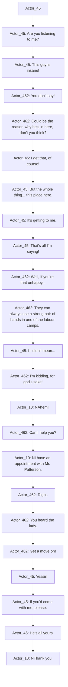

# Ionia/Wenger Sanatorium/West/West Wing

```mermaid
graph TD
    501_0["Actor_45"]
    501_1["Actor_45: Are you listening to me?"]
    501_2["Actor_45: This guy is insane!"]
    501_3["Actor_462: You don't say!"]
    501_4["Actor_462: Could be the reason why he's in here, don't you think?"]
    501_5["Actor_45: I get that, of course!"]
    501_6["Actor_45: But the whole thing... this place here."]
    501_7["Actor_45: It's getting to me."]
    501_8["Actor_45: That's all I'm saying!"]
    501_9["Actor_462: Well, if you're that unhappy..."]
    501_10["Actor_462: They can always use a strong pair of hands in one of the labour camps."]
    501_11["Actor_45: I-i didn't mean..."]
    501_12["Actor_462: I'm kidding, for god's sake!"]
    501_13["Actor_10: NAhem!"]
    501_14["Actor_462: Can I help you?"]
    501_15["Actor_10: NI have an appointment with Mr. Patterson."]
    501_16["Actor_462: Right."]
    501_17["Actor_462: You heard the lady."]
    501_18["Actor_462: Get a move on!"]
    501_19["Actor_45: Yessir!"]
    501_20["Actor_45: If you'd come with me, please."]
    501_21["Actor_45: He's all yours."]
    501_22["Actor_10: NThank you."]
    501_0 --> 501_1
    501_1 --> 501_2
    501_2 --> 501_3
    501_3 --> 501_4
    501_4 --> 501_5
    501_5 --> 501_6
    501_6 --> 501_7
    501_7 --> 501_8
    501_8 --> 501_9
    501_9 --> 501_10
    501_10 --> 501_11
    501_11 --> 501_12
    501_12 --> 501_13
    501_13 --> 501_14
    501_14 --> 501_15
    501_15 --> 501_16
    501_16 --> 501_17
    501_17 --> 501_18
    501_18 --> 501_19
    501_19 --> 501_20
    501_20 --> 501_21
    501_21 --> 501_22
```