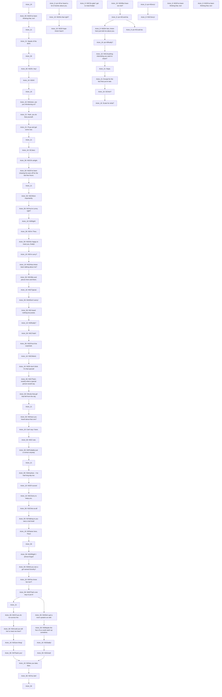

# Paradise/Checkpoint/Trigonometry

```mermaid
graph TD
    54_0["Actor_24"]
    54_1["Actor_56: NGDI've been thinking that, too!"]
    54_2["Actor_56"]
    54_3["Actor_56: NSOh, hey!"]
    54_5["Actor_21"]
    54_6["Actor_16: NSHi!"]
    54_8["Actor_16: pic=6Really?"]
    54_9["Actor_9: pic=6I've heard a lot of stories about you."]
    54_10["Actor_9: NSCSo glad I get to meet finally!"]
    54_11["Actor_16: NGDIs that right?"]
    54_12["Actor_16: NGDI hope Anton hasn't "]
    54_13["Actor_21: Speak of the devil."]
    54_14["Actor_16"]
    54_15["Actor_16: NSAnton, are you introducing us?"]
    54_16["Actor_9: pic=6Could be."]
    54_17["Actor_9: NGDIn fact, Anton here just told me about you."]
    54_18["Actor_16: NSCAnything interesting you want to share?"]
    54_19["Actor_9: pic=6Sorry!"]
    54_20["Actor_9: NSCSorry!"]
    54_21["Actor_21: Nope."]
    54_22["Actor_21: Except for the fact that you're late."]
    54_23["Actor_16: SCHuh?"]
    54_24["Actor_16: SLate for what?"]
    54_25["Actor_16: NGDBut have we met?"]
    54_26["Actor_9: pic=6Could be."]
    54_27["Actor_56: NSCIt's alright."]
    54_28["Actor_21: Yeah, you do that yourself."]
    54_29["Actor_16: SCJeez."]
    54_30["Actor_56: NGDI've been chewing his ears off for the last few hours."]
    54_31["Actor_56: NSCMore importantly."]
    54_32["Actor_16: NSRight!"]
    54_33["Actor_56: NGDSo happy to meet you, finally!"]
    54_34["Actor_56: NSI'm Theo."]
    54_35["Actor_21: I'll go and get some rest."]
    54_36["Actor_56: NSYou're Lorna, right?"]
    54_37["Actor_16: NSI'm sorry?"]
    54_38["Actor_56: NSCBits and pieces here and there."]
    54_39["Actor_56: NSCYeah!"]
    54_40["Actor_16: NSCTypical."]
    54_41["Actor_56: NGDYou'd be surprised."]
    54_42["Actor_16: NSCWeird."]
    54_43["Actor_21"]
    54_44["Actor_56: NSCThat's exactly what a special person would say."]
    54_45["Actor_56: NGDDon't worry!"]
    54_46["Actor_56: NSI heard nothing but praise."]
    54_47["Actor_16: NSReally?"]
    54_48["Actor_16: NGDI don't think I'm that special!"]
    54_49["Actor_56: NSLike that girl that fell from the sky."]
    54_50["Actor_21"]
    54_51["Actor_56: NSHave you heard about that one?"]
    54_52["Actor_16: Can't say I have."]
    54_53["Actor_56: NSCI see."]
    54_54["Actor_56: NSProbably just a rumour anyway."]
    54_55["Actor_21"]
    54_56["Actor_56: NSAnyhow – I've had long day too."]
    54_57["Actor_16: NSOf course!"]
    54_58["Actor_16: NSCSorry to keep you."]
    54_59["Actor_56: NSCNot at all!"]
    54_60["Actor_56: NSTalking to you was a real treat!"]
    54_61["Actor_16: NSSame here, Theo!"]
    54_62["Actor_56"]
    54_63["Actor_56: NGDRight! I almost forgot!"]
    54_64["Actor_56: NSDid you see a girl named Dorothy?"]
    54_65["Actor_16: NWYou know her too?!"]
    54_66["Actor_56: NGDThat's one way to put it!"]
    54_67["Actor_56: NSShe's got a room upstairs as well."]
    54_68["Actor_56: NSCIf you do run across her."]
    54_69["Actor_56: NSCould you tell her to meet me here?"]
    54_70["Actor_16: NSSure thing!"]
    54_71["Actor_56: NSThank you!"]
    54_72["Actor_16: NSSee you later, then."]
    54_73["Actor_16: NSGladly!"]
    54_74["Actor_56: NSMaybe the four of us could catch up sometime."]
    54_75["Actor_56: NSGreat!"]
    54_76["Actor_56: NSYou bet!"]
    54_77["Actor_21"]
    54_78["Actor_56"]
    54_79["Actor_9: NGDI've been thinking that, too!"]
    54_80["Actor_9: NGDI've been thinking that, too!"]
    54_82["Actor_16: NGDHas Anton been talking about me?"]
    54_83["Actor_21"]
    54_0 --> 54_1
    54_1 --> 54_5
    54_2 --> 54_3
    54_3 --> 54_6
    54_5 --> 54_13
    54_6 --> 54_14
    54_8 --> 54_18
    54_9 --> 54_11
    54_11 --> 54_12
    54_13 --> 54_2
    54_14 --> 54_15
    54_15 --> 54_28
    54_16 --> 54_17
    54_16 --> 54_26
    54_17 --> 54_8
    54_18 --> 54_21
    54_19 --> 54_20
    54_21 --> 54_22
    54_22 --> 54_23
    54_23 --> 54_24
    54_25 --> 54_16
    54_27 --> 54_30
    54_28 --> 54_35
    54_29 --> 54_27
    54_30 --> 54_43
    54_31 --> 54_36
    54_32 --> 54_34
    54_33 --> 54_37
    54_34 --> 54_33
    54_35 --> 54_77
    54_36 --> 54_32
    54_37 --> 54_82
    54_38 --> 54_40
    54_39 --> 54_41
    54_40 --> 54_45
    54_41 --> 54_42
    54_42 --> 54_48
    54_43 --> 54_31
    54_44 --> 54_49
    54_45 --> 54_46
    54_46 --> 54_47
    54_47 --> 54_39
    54_48 --> 54_44
    54_49 --> 54_50
    54_50 --> 54_51
    54_51 --> 54_52
    54_52 --> 54_53
    54_53 --> 54_54
    54_54 --> 54_55
    54_55 --> 54_56
    54_56 --> 54_57
    54_57 --> 54_58
    54_58 --> 54_59
    54_59 --> 54_60
    54_60 --> 54_61
    54_61 --> 54_62
    54_62 --> 54_63
    54_63 --> 54_64
    54_64 --> 54_65
    54_65 --> 54_66
    54_66 --> 54_67
    54_66 --> 54_83
    54_67 --> 54_74
    54_68 --> 54_69
    54_69 --> 54_70
    54_70 --> 54_71
    54_71 --> 54_72
    54_72 --> 54_76
    54_73 --> 54_75
    54_74 --> 54_73
    54_75 --> 54_72
    54_76 --> 54_78
    54_77 --> 54_29
    54_82 --> 54_38
    54_83 --> 54_68
```