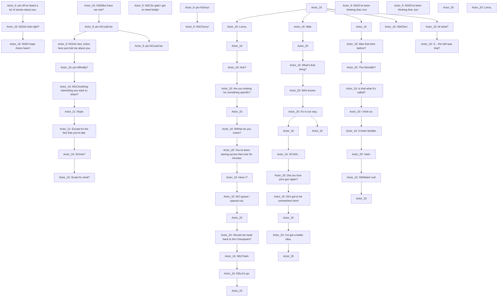

# Paradise/Glade

```mermaid
graph TD
    70_0["Actor_16"]
    70_1["Actor_20: Lorna."]
    70_5["Actor_16"]
    70_8["Actor_16: pic=6Really?"]
    70_9["Actor_9: pic=6I've heard a lot of stories about you."]
    70_10["Actor_9: NSCSo glad I get to meet finally!"]
    70_11["Actor_16: NGDIs that right?"]
    70_12["Actor_16: NGDI hope Anton hasn't "]
    70_16["Actor_9: pic=6Could be."]
    70_17["Actor_9: NGDIn fact, Anton here just told me about you."]
    70_18["Actor_16: NSCAnything interesting you want to share?"]
    70_19["Actor_9: pic=6Sorry!"]
    70_20["Actor_9: NSCSorry!"]
    70_21["Actor_21: Nope."]
    70_22["Actor_21: Except for the fact that you're late."]
    70_23["Actor_16: SCHuh?"]
    70_24["Actor_16: SLate for what?"]
    70_25["Actor_16: NGDBut have we met?"]
    70_26["Actor_9: pic=6Could be."]
    70_79["Actor_9: NGDI've been thinking that, too!"]
    70_80["Actor_9: NGDI've been thinking that, too!"]
    70_81["Actor_16"]
    70_82["Actor_16: Huh?"]
    70_83["Actor_20: Are you looking for something specific?"]
    70_84["Actor_20"]
    70_85["Actor_16: RWhat do you mean?"]
    70_86["Actor_20: You've been staring across that river for minutes."]
    70_87["Actor_16: Have I?"]
    70_88["Actor_16: NCI guess I spaced out."]
    70_89["Actor_20: Should we head back to the Checkpoint?"]
    70_92["Actor_20"]
    70_93["Actor_16: NSCYeah."]
    70_94["Actor_20"]
    70_95["Actor_20"]
    70_98["Actor_16: Was that here before?"]
    70_99["Actor_20: The Monolith?"]
    70_100["Actor_16: Is that what it's called?"]
    70_101["Actor_20: I think so."]
    70_102["Actor_16: It looks familiar."]
    70_103["Actor_20: Yeah."]
    70_105["Actor_16: SWWatch out!"]
    70_106["Actor_16: SWCleo!"]
    70_107["Actor_16: W-what?"]
    70_108["Actor_16: S... the hell was that?"]
    70_109["Actor_20: Lorna."]
    70_110["Actor_16: Wait."]
    70_111["Actor_20"]
    70_112["Actor_16: What's that thing?"]
    70_113["Actor_20: Who knows."]
    70_114["Actor_20: It's in our way."]
    70_115["Actor_16"]
    70_116["Actor_16: SCUhh..."]
    70_117["Actor_20: Did you lose your gun again?"]
    70_118["Actor_16: SIt's got to be somewhere here!"]
    70_120["Actor_20: I've got a better idea."]
    70_121["Actor_20"]
    70_123["Actor_20"]
    70_124["Actor_16: NSLet's go."]
    70_125["Actor_16"]
    70_126["Actor_20"]
    70_0 --> 70_1
    70_0 --> 70_110
    70_0 --> 70_81
    70_0 --> 70_106
    70_0 --> 70_107
    70_1 --> 70_5
    70_5 --> 70_82
    70_8 --> 70_18
    70_9 --> 70_11
    70_11 --> 70_12
    70_16 --> 70_17
    70_16 --> 70_26
    70_17 --> 70_8
    70_18 --> 70_21
    70_19 --> 70_20
    70_21 --> 70_22
    70_22 --> 70_23
    70_23 --> 70_24
    70_25 --> 70_16
    70_81 --> 70_98
    70_82 --> 70_83
    70_83 --> 70_84
    70_84 --> 70_85
    70_85 --> 70_86
    70_86 --> 70_87
    70_87 --> 70_88
    70_88 --> 70_95
    70_89 --> 70_93
    70_93 --> 70_124
    70_95 --> 70_89
    70_98 --> 70_99
    70_99 --> 70_100
    70_100 --> 70_101
    70_101 --> 70_102
    70_102 --> 70_103
    70_103 --> 70_105
    70_105 --> 70_126
    70_107 --> 70_108
    70_110 --> 70_111
    70_111 --> 70_112
    70_112 --> 70_113
    70_113 --> 70_114
    70_114 --> 70_115
    70_114 --> 70_125
    70_115 --> 70_116
    70_116 --> 70_117
    70_117 --> 70_118
    70_118 --> 70_121
    70_120 --> 70_123
    70_121 --> 70_120
    70_124 --> 70_94
```