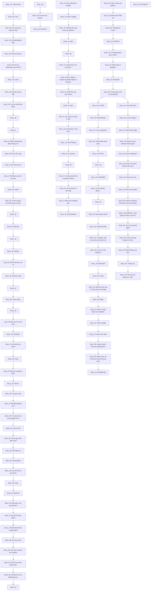

# Paradise/Thermopylae/Checkpoint Check

```mermaid
graph TD
    34_0["Actor_16"]
    34_1["Actor_26: Excuse me, ma'am."]
    34_3["Actor_26: Have I seen you before?"]
    34_4["Actor_26: Thought as much!"]
    34_5["Actor_16: NSCSo?"]
    34_8["Actor_26: You planning to go in there?"]
    34_9["Actor_16: NSYeah?"]
    34_10["Actor_16: NSCIs that a problem?"]
    34_11["Actor_26: Depends."]
    34_14["Actor_26: Do you remember your name?"]
    34_15["Actor_16: Lorna."]
    34_16["Actor_26: Doesn't ring a bell."]
    34_17["Actor_26: Let me check the book."]
    34_18["Actor_16"]
    34_19["Actor_9"]
    34_20["Actor_9: NSCIs that gonna take all day or?"]
    34_21["Actor_26: Fuck off, Theo."]
    34_22["Actor_9: pic=6I'd love to."]
    34_23["Actor_9: NSCBut you're in my way."]
    34_24["Actor_26: Yeah?"]
    34_25["Actor_26: Then I guess you'll just have to wait."]
    34_26["Actor_16"]
    34_27["Actor_9: NSCHey."]
    34_28["Actor_16: NSCHi."]
    34_31["Actor_9: NSCFine day, isn't it?"]
    34_33["Actor_26: Sorry, Miss."]
    34_34["Actor_26: But you're not in here."]
    34_35["Actor_9: pic=6Are you sure?"]
    34_36["Actor_26: Yeah."]
    34_37["Actor_9: NSCLet me take a look."]
    34_38["Actor_26: Hell no."]
    34_39["Actor_26: You go on by."]
    34_40["Actor_9: NSCWhat about her?"]
    34_42["Actor_26: I'll need to see some papers first."]
    34_43["Actor_16: Like an ID?"]
    34_44["Actor_26: You've got one, don't you?"]
    34_45["Actor_16: NCI think so."]
    34_46["Actor_16: Somewhere."]
    34_47["Actor_26: Let me know if you find it."]
    34_48["Actor_26: Theo."]
    34_51["Actor_26: Why don't you go with her?"]
    34_52["Actor_9: pic=6You know what?"]
    34_53["Actor_9: NGDI think that's a great idea!"]
    34_54["Actor_26: Don't you worry about that."]
    34_55["Actor_26: He'll be the one bothering you."]
    34_57["Actor_16: Like this here?"]
    34_58["Actor_16: I don't know."]
    34_59["Actor_26: Huh."]
    34_60["Actor_26: You lost your memory too?"]
    34_61["Actor_16: Something like that."]
    34_62["Actor_26: Sorry to hear it."]
    34_63["Actor_16"]
    34_64["Actor_9: Sorry about the trouble."]
    34_65["Actor_16: NCIt's alright."]
    34_66["Actor_9: Yeah."]
    34_67["Actor_9: I don't know if it's any help..."]
    34_68["Actor_16: NSCMy ID's got to be somewhere."]
    34_69["Actor_16"]
    34_70["Actor_9: But I heard a couple of people talking in the pub."]
    34_71["Actor_9: Yeah."]
    34_72["Actor_16: NSCThe one over there?"]
    34_73["Actor_9: You want to check it out?"]
    34_74["Actor_16: pic=6Yeah, I'll do that."]
    34_75["Actor_16: NSCThanks!"]
    34_76["Actor_9: No worries."]
    34_77["Actor_9: Was nice meeting you."]
    34_78["Actor_16: NSCLikewise."]
    34_79["Actor_9: I'll stick around for a couple of hours."]
    34_80["Actor_9: Let me know if I can help."]
    34_81["Actor_16"]
    34_82["Actor_16"]
    34_83["Actor_16: NSCFor sure!"]
    34_84["Actor_16"]
    34_85["Actor_16: NCDamn."]
    34_88["Actor_9: NSCHm?"]
    34_90["Actor_16: Are you sure?"]
    34_91["Actor_16: NCI don't want to be a bother."]
    34_92["Actor_16"]
    34_93["Actor_16: NSCYeah?"]
    34_94["Actor_16: NGDI don't think so!"]
    34_95["Actor_26: You've got an ID or something?"]
    34_96["Actor_16: A what?"]
    34_97["Actor_26: Identification."]
    34_98["Actor_16: Like a passport?"]
    34_99["Actor_26: That would work, yeah."]
    34_100["Actor_16: NCHm."]
    34_101["Actor_16"]
    34_102["Actor_16: NSCRight!"]
    34_103["Actor_16: pic=6How about..."]
    34_104["Actor_16"]
    34_105["Actor_26: How about what?"]
    34_106["Actor_16: NCNevermind."]
    34_107["Actor_16: I thought I had my service card with me."]
    34_108["Actor_26: You're in the military?"]
    34_109["Actor_16: NSCYeah!"]
    34_110["Actor_26: Fancy."]
    34_111["Actor_16: NCNot much use if I can't prove it, though."]
    34_112["Actor_26: Right."]
    34_113["Actor_26: Wish I could make an exception."]
    34_114["Actor_16: NCIt's alright."]
    34_115["Actor_26: Unless you're the one making them."]
    34_116["Actor_16: Rules are rules."]
    34_117["Actor_26: Either way, let me know if you find your card."]
    34_118["Actor_16: NSCWill do!"]
    34_119["Actor_26: Lorna Farago?"]
    34_120["Actor_16: NSCThat's right!"]
    34_121["Actor_26: Wait. Are you with that Anton guy?"]
    34_122["Actor_16: Anton Polyakov?"]
    34_123["Actor_26: Yeah. He had a card like this one."]
    34_124["Actor_26: Same unit, too."]
    34_125["Actor_16: NSCIs he inside?"]
    34_126["Actor_26: Unless someone threw him out of a window."]
    34_127["Actor_26: You can say that again."]
    34_128["Actor_16: NGDHe's a real piece of work, isn't he?"]
    34_129["Actor_26: If he's causing trouble in there-"]
    34_130["Actor_16: NSCI'll take care of it."]
    34_131["Actor_26: Thank you."]
    34_132["Actor_26: Don't let me keep you, then."]
    34_0 --> 34_1
    34_1 --> 34_9
    34_3 --> 34_94
    34_4 --> 34_5
    34_5 --> 34_8
    34_8 --> 34_10
    34_10 --> 34_11
    34_11 --> 34_95
    34_14 --> 34_15
    34_15 --> 34_16
    34_16 --> 34_17
    34_17 --> 34_18
    34_18 --> 34_19
    34_19 --> 34_20
    34_20 --> 34_21
    34_21 --> 34_22
    34_22 --> 34_23
    34_23 --> 34_24
    34_24 --> 34_25
    34_25 --> 34_26
    34_26 --> 34_27
    34_27 --> 34_82
    34_28 --> 34_31
    34_31 --> 34_83
    34_33 --> 34_84
    34_34 --> 34_85
    34_35 --> 34_36
    34_36 --> 34_37
    34_37 --> 34_38
    34_38 --> 34_39
    34_39 --> 34_40
    34_40 --> 34_42
    34_42 --> 34_43
    34_43 --> 34_44
    34_44 --> 34_45
    34_45 --> 34_46
    34_46 --> 34_47
    34_47 --> 34_48
    34_48 --> 34_88
    34_51 --> 34_52
    34_52 --> 34_53
    34_53 --> 34_90
    34_54 --> 34_55
    34_55 --> 34_63
    34_57 --> 34_119
    34_58 --> 34_59
    34_59 --> 34_60
    34_60 --> 34_61
    34_61 --> 34_62
    34_62 --> 34_14
    34_64 --> 34_65
    34_65 --> 34_68
    34_66 --> 34_69
    34_67 --> 34_70
    34_68 --> 34_66
    34_69 --> 34_67
    34_70 --> 34_72
    34_71 --> 34_73
    34_72 --> 34_71
    34_73 --> 34_74
    34_74 --> 34_75
    34_75 --> 34_76
    34_76 --> 34_81
    34_77 --> 34_78
    34_79 --> 34_80
    34_80 --> 34_77
    34_81 --> 34_79
    34_82 --> 34_28
    34_83 --> 34_92
    34_84 --> 34_34
    34_85 --> 34_35
    34_88 --> 34_51
    34_90 --> 34_91
    34_91 --> 34_54
    34_92 --> 34_33
    34_94 --> 34_4
    34_95 --> 34_57
    34_95 --> 34_96
    34_96 --> 34_97
    34_97 --> 34_98
    34_98 --> 34_99
    34_99 --> 34_100
    34_100 --> 34_101
    34_101 --> 34_102
    34_102 --> 34_103
    34_103 --> 34_104
    34_104 --> 34_105
    34_105 --> 34_106
    34_106 --> 34_107
    34_107 --> 34_108
    34_108 --> 34_109
    34_109 --> 34_110
    34_110 --> 34_111
    34_111 --> 34_112
    34_112 --> 34_113
    34_113 --> 34_114
    34_114 --> 34_116
    34_115 --> 34_117
    34_116 --> 34_115
    34_117 --> 34_118
    34_119 --> 34_120
    34_120 --> 34_121
    34_121 --> 34_122
    34_122 --> 34_123
    34_123 --> 34_124
    34_124 --> 34_125
    34_125 --> 34_126
    34_126 --> 34_128
    34_127 --> 34_129
    34_128 --> 34_127
    34_129 --> 34_130
    34_130 --> 34_131
    34_131 --> 34_132
```