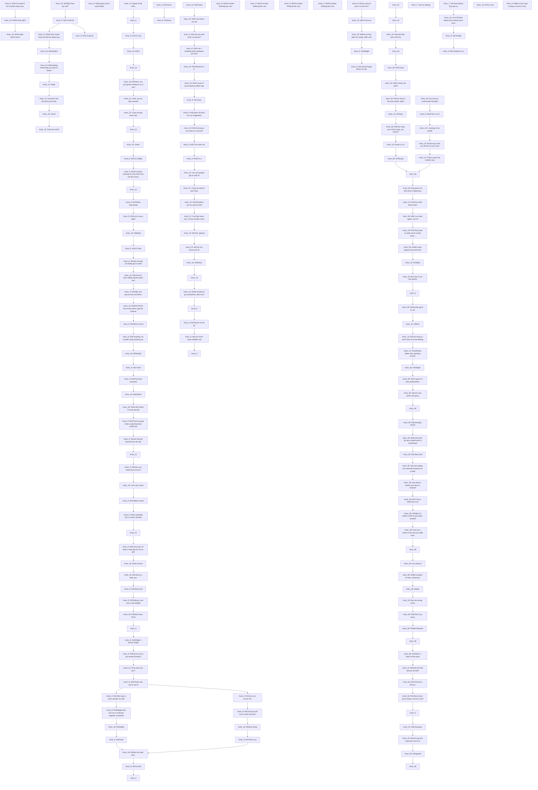

# Paradise/Thermopylae/Familiarity

```mermaid
graph TD
    58_0["Actor_24"]
    58_1["Actor_56"]
    58_2["Actor_9"]
    58_3["Actor_9: NSOh, hey!"]
    58_5["Actor_56: NSCGreat. "]
    58_6["Actor_16: NSHi!"]
    58_8["Actor_16: NSCReally?"]
    58_9["Actor_9: NSCI've heard a lot of stories about you."]
    58_10["Actor_9: NSSo glad I get to meet finally!"]
    58_11["Actor_16: NGDIs that right?"]
    58_12["Actor_16: NGDI hope Anton hasn't "]
    58_13["Actor_21: Speak of the devil."]
    58_14["Actor_16"]
    58_15["Actor_16: NSAnton, are you gonna introduce us or not?"]
    58_16["Actor_9: NSCCould be."]
    58_17["Actor_9: NGDIn fact, Anton here just told me about you."]
    58_18["Actor_16: NSAnything interesting you want to share?"]
    58_19["Actor_9: NSCSorry!"]
    58_20["Actor_9: NSSorry!"]
    58_21["Actor_21: Nope."]
    58_22["Actor_21: Except for the fact that you're late."]
    58_23["Actor_16: 4Huh?"]
    58_24["Actor_16: 3Late for what?"]
    58_25["Actor_16: NGDBut have we met?"]
    58_26["Actor_9: NSCCould be."]
    58_27["Actor_9: NSCIt's alright."]
    58_28["Actor_21: Yeah, you do that yourself."]
    58_29["Actor_16: 4Jeez."]
    58_30["Actor_9: NGDI've been chewing his ears off for the last few hours."]
    58_31["Actor_9: NSCMore importantly."]
    58_32["Actor_16: NSRight!"]
    58_33["Actor_9: NGDSo excited we finally get to meet!"]
    58_34["Actor_9: NSI'm Theo."]
    58_35["Actor_21: I'll go and get some rest."]
    58_36["Actor_9: NSYou're Lorna, right?"]
    58_37["Actor_16: NSCHas he been telling stories about me?"]
    58_38["Actor_9: NSCBits and pieces here and there."]
    58_39["Actor_9: NSCYeah!"]
    58_40["Actor_16: NGDI'll remind him of that when I get the chance!"]
    58_41["Actor_9: NGDYou'd be surprised."]
    58_42["Actor_16: NSCWeird."]
    58_43["Actor_21"]
    58_44["Actor_9: NSCThat's exactly what a special person would say."]
    58_45["Actor_9: NGDDon't worry!"]
    58_46["Actor_9: NSIf anything, he wouldn't stop praising you."]
    58_47["Actor_16: NSReally?"]
    58_48["Actor_16: NGDI don't think I'm that special!"]
    58_49["Actor_9: NSLike that girl that fell from the sky."]
    58_50["Actor_21"]
    58_51["Actor_9: NSHave you heard that one too?"]
    58_52["Actor_16: Can't say I have."]
    58_53["Actor_9: NSCMakes sense."]
    58_54["Actor_9: NSIt's probably just a rumour anyway."]
    58_55["Actor_21"]
    58_56["Actor_9: NSAt any rate, it's been a long day for me as well."]
    58_57["Actor_16: NSOf course!"]
    58_58["Actor_16: NSCSorry to keep you."]
    58_59["Actor_9: NSCNot at all!"]
    58_60["Actor_9: NSTalking to you was a real delight!"]
    58_61["Actor_16: NSSame here, Theo!"]
    58_62["Actor_9"]
    58_63["Actor_9: NGDRight! I almost forgot!"]
    58_64["Actor_9: NSDid you see a girl named Dorothy?"]
    58_65["Actor_16: 9You know her too?!"]
    58_66["Actor_9: NGDThat's one way to put it!"]
    58_67["Actor_9: NSCShe's got a room upstairs as well."]
    58_68["Actor_9: NSIf you run across her."]
    58_69["Actor_9: NSCould you tell her to meet me here?"]
    58_70["Actor_16: NSSure thing!"]
    58_71["Actor_9: NSThank you!"]
    58_72["Actor_16: NSSee you later, then."]
    58_73["Actor_16: NSGladly!"]
    58_74["Actor_9: NGDMaybe the four of us could get together sometime!"]
    58_75["Actor_9: NSGreat!"]
    58_76["Actor_9: NSYou bet!"]
    58_77["Actor_21"]
    58_78["Actor_9"]
    58_79["Actor_9: NGDI've been thinking that, too!"]
    58_80["Actor_9: NGDI've been thinking that, too!"]
    58_81["Actor_9: NGDI've been thinking that, too!"]
    58_82["Actor_9: NGDI've been thinking that, too!"]
    58_83["Actor_16"]
    58_84["Actor_10: NSLooks like we're all here."]
    58_85["Actor_16: NSSo what's the plan?"]
    58_86["Actor_56: NSYou were in the area earlier, right?"]
    58_87["Actor_10: NSYeah."]
    58_88["Actor_56: NSHow many are in that camp, you reckon?"]
    58_90["Actor_10: Dozen or so."]
    58_91["Actor_9: NSYou want to join in on the fun?"]
    58_92["Actor_23: NSCI'd love to."]
    58_93["Actor_23: NSBut we had plans for today, didn't we?"]
    58_94["Actor_9: NGDRight!"]
    58_95["Actor_9: NSI almost forgot about our trip."]
    58_97["Actor_56: NCRough."]
    58_100["Actor_9: NSAll five of us?"]
    58_101["Actor_16: NGDYeah!"]
    58_102["Actor_16: NSIt's the least I can do!"]
    58_103["Actor_9: NSCAre you that kind of a person?"]
    58_104["Actor_9: NSOr am I smelling history between you two?"]
    58_105["Actor_23: NSCWhatever it is."]
    58_106["Actor_23: NSIt's none of your business either way."]
    58_107["Actor_9: NSCAww."]
    58_108["Actor_9: NSGuess I'll leave it to my imagination."]
    58_109["Actor_23: NSCAs long as you keep it to yourself."]
    58_110["Actor_9: NSCYou know me."]
    58_111["Actor_9: NGDI'm a-"]
    58_112["Actor_21: Can you people get on with it?"]
    58_113["Actor_21: I'll get an earful if we're late."]
    58_114["Actor_23: NSCShouldn't you be used to that?"]
    58_115["Actor_21: You'll get some too, if I hear another word."]
    58_116["Actor_23: NSCOh, please!"]
    58_117["Actor_23: NSYou can shove your th-"]
    58_118["Actor_16: NGDHey!"]
    58_119["Actor_16"]
    58_120["Actor_16: NSWe wanted to go somewhere, didn't we?"]
    58_121["Actor_5"]
    58_122["Actor_9: NSCWords to live by."]
    58_123["Actor_9: NSLet's mess some Gobbies up!"]
    58_124["Actor_9"]
    58_126["Actor_16: Any way we could sneak through?"]
    58_127["Actor_16: I could go in by myself."]
    58_128["Actor_10: NCNo way I'd let you do this on your own!"]
    58_130["Actor_10: There's got to be a better way."]
    58_131["Actor_56"]
    58_132["Actor_56: NSI guess our best shot is diplomacy."]
    58_133["Actor_10: NGDYou think that'll work?"]
    58_134["Actor_56: NSIt's our best option, isn't it?"]
    58_135["Actor_16: NCIf they jump us while we're in their camp..."]
    58_136["Actor_56: NSWe could always jump them first."]
    58_137["Actor_16: NCRight."]
    58_138["Actor_5"]
    58_139["Actor_56: NSSounds good to me."]
    58_140["Actor_10: NSDito."]
    58_141["Actor_10: NSCAs long as I don't have to do the talking."]
    58_142["Actor_21: Everything's better than standing around."]
    58_145["Actor_7: Let's try talking."]
    58_146["Actor_7: Get them before they get us."]
    58_149["Actor_16: Let's hit them before they realize we're here."]
    58_150["Actor_56: NSAlright."]
    58_151["Actor_56: NSCI guess I'll play ambassador."]
    58_152["Actor_56: NSLet's see where this goes."]
    58_153["Actor_56"]
    58_154["Actor_9: NSCAlright."]
    58_155["Actor_9: RGCViolence it is."]
    58_156["Actor_56: NSGreetings, friend!"]
    58_157["Actor_39: What the fuck? You got a death-wish or something?"]
    58_158["Actor_56: NSCNot at all!"]
    58_159["Actor_56: NSI was hoping we could talk business for a spell."]
    58_160["Actor_39: How about I smash your face in, instead?"]
    58_161["Actor_56: RGCYou're welcome to try."]
    58_162["Actor_56: NGDBut I'd prefer to talk to your boss, instead!"]
    58_163["Actor_56: NSCDon't you worry."]
    58_164["Actor_39: Give me a reason not to gut you right here."]
    58_165["Actor_56"]
    58_166["Actor_39: You serious?"]
    58_167["Actor_56: NSWe wouldn't be here, otherwise."]
    58_168["Actor_39: Alright."]
    58_169["Actor_39: But one wrong move-"]
    58_170["Actor_56: NSWe'll behave!"]
    58_171["Actor_56"]
    58_172["Actor_56: NGDSee? I knew it'd be easy!"]
    58_173["Actor_16: NWHow the hell did you do that?"]
    58_174["Actor_10: NSCAnyways."]
    58_175["Actor_56: NSCI'd love to tell you."]
    58_176["Actor_56: RGCBut a boy's got to keep a secret or two!"]
    58_177["Actor_16: NCFor sure."]
    58_178["Actor_5"]
    58_179["Actor_9: NSBut a boy's got to keep a secret or two."]
    58_180["Actor_10: NSLet's go and make the most of it."]
    58_181["Actor_56: NSAgreed!"]
    58_182["Actor_56"]
    58_183["Actor_16: But Cleo is our first priority."]
    58_0 --> 58_83
    58_1 --> 58_5
    58_2 --> 58_3
    58_3 --> 58_6
    58_5 --> 58_85
    58_6 --> 58_14
    58_8 --> 58_18
    58_9 --> 58_11
    58_11 --> 58_12
    58_13 --> 58_2
    58_14 --> 58_15
    58_15 --> 58_28
    58_16 --> 58_17
    58_16 --> 58_26
    58_17 --> 58_8
    58_18 --> 58_21
    58_19 --> 58_20
    58_21 --> 58_22
    58_22 --> 58_23
    58_23 --> 58_24
    58_25 --> 58_16
    58_27 --> 58_30
    58_28 --> 58_35
    58_29 --> 58_27
    58_30 --> 58_43
    58_31 --> 58_36
    58_32 --> 58_34
    58_33 --> 58_37
    58_34 --> 58_33
    58_35 --> 58_77
    58_36 --> 58_32
    58_37 --> 58_38
    58_38 --> 58_40
    58_39 --> 58_41
    58_40 --> 58_45
    58_41 --> 58_42
    58_42 --> 58_48
    58_43 --> 58_31
    58_44 --> 58_49
    58_45 --> 58_46
    58_46 --> 58_47
    58_47 --> 58_39
    58_48 --> 58_44
    58_49 --> 58_50
    58_50 --> 58_51
    58_51 --> 58_52
    58_52 --> 58_53
    58_53 --> 58_54
    58_54 --> 58_55
    58_55 --> 58_56
    58_56 --> 58_57
    58_57 --> 58_58
    58_58 --> 58_59
    58_59 --> 58_60
    58_60 --> 58_61
    58_61 --> 58_62
    58_62 --> 58_63
    58_63 --> 58_64
    58_64 --> 58_65
    58_65 --> 58_66
    58_66 --> 58_67
    58_66 --> 58_68
    58_67 --> 58_74
    58_68 --> 58_69
    58_69 --> 58_70
    58_70 --> 58_71
    58_71 --> 58_72
    58_72 --> 58_76
    58_73 --> 58_75
    58_74 --> 58_73
    58_75 --> 58_72
    58_76 --> 58_78
    58_77 --> 58_29
    58_83 --> 58_84
    58_84 --> 58_1
    58_85 --> 58_86
    58_86 --> 58_87
    58_87 --> 58_88
    58_88 --> 58_90
    58_90 --> 58_97
    58_91 --> 58_92
    58_92 --> 58_93
    58_93 --> 58_94
    58_94 --> 58_95
    58_97 --> 58_131
    58_100 --> 58_127
    58_101 --> 58_102
    58_102 --> 58_103
    58_103 --> 58_104
    58_104 --> 58_105
    58_105 --> 58_106
    58_106 --> 58_107
    58_107 --> 58_108
    58_108 --> 58_109
    58_109 --> 58_110
    58_110 --> 58_111
    58_111 --> 58_112
    58_112 --> 58_113
    58_113 --> 58_114
    58_114 --> 58_115
    58_115 --> 58_116
    58_116 --> 58_117
    58_117 --> 58_118
    58_118 --> 58_119
    58_119 --> 58_120
    58_120 --> 58_121
    58_121 --> 58_122
    58_122 --> 58_123
    58_123 --> 58_124
    58_126 --> 58_100
    58_127 --> 58_128
    58_128 --> 58_130
    58_130 --> 58_131
    58_131 --> 58_132
    58_132 --> 58_133
    58_133 --> 58_134
    58_134 --> 58_135
    58_135 --> 58_136
    58_136 --> 58_137
    58_137 --> 58_183
    58_138 --> 58_139
    58_139 --> 58_140
    58_140 --> 58_141
    58_141 --> 58_142
    58_142 --> 58_150
    58_146 --> 58_149
    58_149 --> 58_154
    58_150 --> 58_151
    58_151 --> 58_152
    58_152 --> 58_153
    58_153 --> 58_156
    58_154 --> 58_155
    58_156 --> 58_157
    58_157 --> 58_158
    58_158 --> 58_159
    58_159 --> 58_160
    58_160 --> 58_161
    58_161 --> 58_162
    58_162 --> 58_164
    58_163 --> 58_170
    58_164 --> 58_165
    58_165 --> 58_166
    58_166 --> 58_167
    58_167 --> 58_168
    58_168 --> 58_169
    58_169 --> 58_163
    58_170 --> 58_171
    58_171 --> 58_172
    58_172 --> 58_173
    58_173 --> 58_175
    58_174 --> 58_180
    58_175 --> 58_176
    58_176 --> 58_178
    58_178 --> 58_174
    58_180 --> 58_181
    58_181 --> 58_182
    58_183 --> 58_138
```