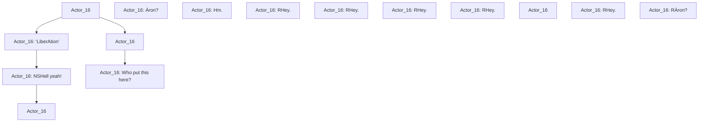

# Paradise/Thermopylae/LiberAtion

```mermaid
graph TD
    29_0["Actor_16"]
    29_161["Actor_16: Áron?"]
    29_162["Actor_16: Hm."]
    29_163["Actor_16: RHey."]
    29_164["Actor_16: RHey."]
    29_165["Actor_16: RHey."]
    29_166["Actor_16: RHey."]
    29_167["Actor_16: 'LiberAtion'"]
    29_168["Actor_16"]
    29_169["Actor_16: RHey."]
    29_172["Actor_16: RÁron?"]
    29_174["Actor_16: NSHell yeah!"]
    29_175["Actor_16"]
    29_176["Actor_16"]
    29_177["Actor_16: Who put this here?"]
    29_0 --> 29_167
    29_0 --> 29_176
    29_167 --> 29_174
    29_174 --> 29_175
    29_176 --> 29_177
```