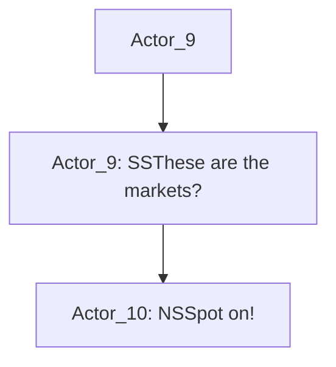

# Trachi/Central/Clarin Square/EV015

```mermaid
graph TD
    503_0["Actor_9"]
    503_1["Actor_9: SSThese are the markets?"]
    503_2["Actor_10: NSSpot on!"]
    503_0 --> 503_1
    503_1 --> 503_2
```