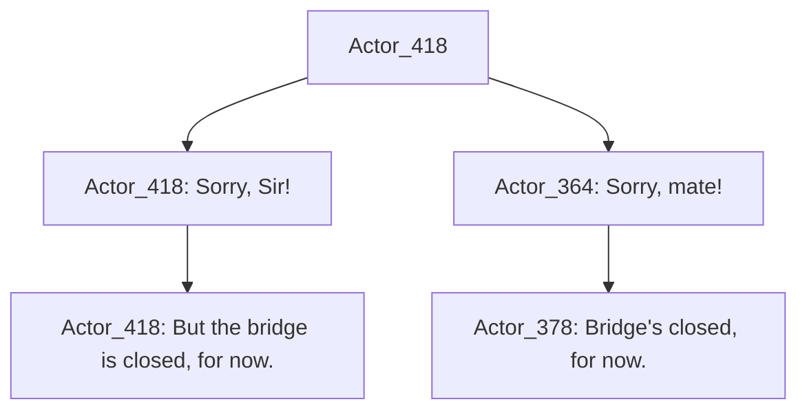

# Trachi/Central/Clarin Square/EV083

```mermaid
graph TD
    504_0["Actor_418"]
    504_1["Actor_418: Sorry, Sir!"]
    504_2["Actor_418: But the bridge is closed, for now."]
    504_3["Actor_364: Sorry, mate!"]
    504_4["Actor_378: Bridge's closed, for now."]
    504_0 --> 504_1
    504_0 --> 504_3
    504_1 --> 504_2
    504_3 --> 504_4
```