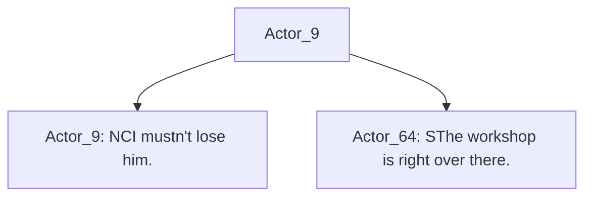

# Trachi/Central/Hudsman Corner/EV0010

```mermaid
graph TD
    509_0["Actor_9"]
    509_1["Actor_9: NCI mustn't lose him."]
    509_2["Actor_64: SThe workshop is right over there."]
    509_0 --> 509_1
    509_0 --> 509_2
```