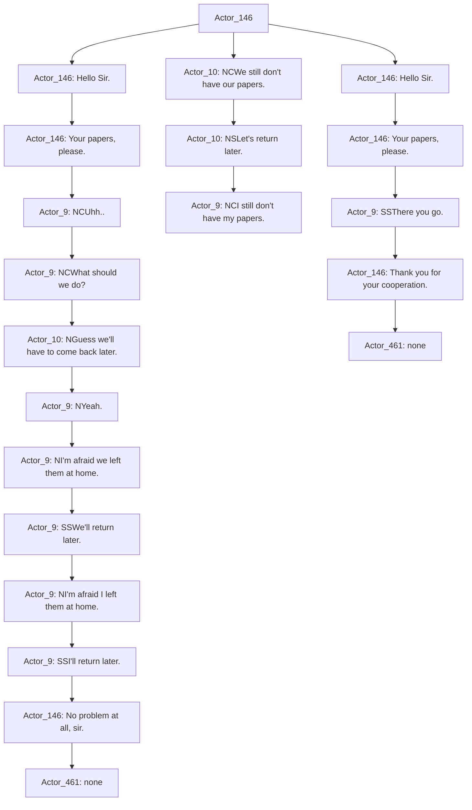

# Trachi/Central/Hudsman Corner/EV010

```mermaid
graph TD
    514_0["Actor_146"]
    514_1["Actor_146: Hello Sir."]
    514_2["Actor_146: Your papers, please."]
    514_3["Actor_9: NCUhh.."]
    514_4["Actor_9: NCWhat should we do?"]
    514_5["Actor_10: NGuess we'll have to come back later."]
    514_6["Actor_9: NYeah."]
    514_7["Actor_9: NI'm afraid we left them at home."]
    514_8["Actor_9: SSWe'll return later."]
    514_9["Actor_9: NI'm afraid I left them at home."]
    514_10["Actor_9: SSI'll return later."]
    514_11["Actor_146: No problem at all, sir."]
    514_12["Actor_461: none"]
    514_13["Actor_10: NCWe still don't have our papers."]
    514_14["Actor_10: NSLet's return later."]
    514_15["Actor_9: NCI still don't have my papers."]
    514_16["Actor_146: Hello Sir."]
    514_17["Actor_146: Your papers, please."]
    514_18["Actor_9: SSThere you go."]
    514_19["Actor_146: Thank you for your cooperation."]
    514_20["Actor_461: none"]
    514_0 --> 514_1
    514_0 --> 514_13
    514_0 --> 514_16
    514_1 --> 514_2
    514_2 --> 514_3
    514_3 --> 514_4
    514_4 --> 514_5
    514_5 --> 514_6
    514_6 --> 514_7
    514_7 --> 514_8
    514_8 --> 514_9
    514_9 --> 514_10
    514_10 --> 514_11
    514_11 --> 514_12
    514_13 --> 514_14
    514_14 --> 514_15
    514_16 --> 514_17
    514_17 --> 514_18
    514_18 --> 514_19
    514_19 --> 514_20
```