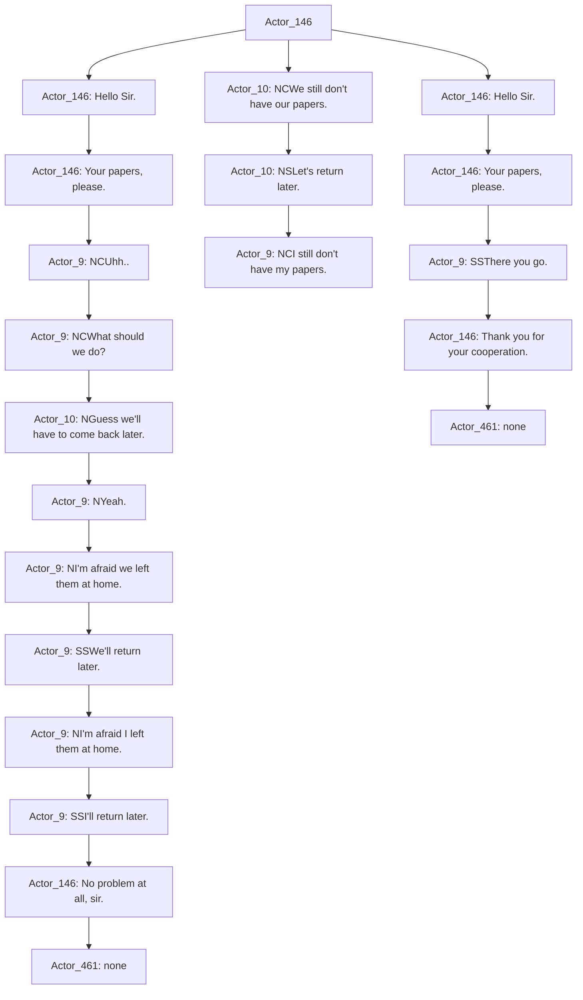

# Trachi/Central/Hudsman Corner/EV016

```mermaid
graph TD
    518_0["Actor_146"]
    518_1["Actor_146: Hello Sir."]
    518_2["Actor_146: Your papers, please."]
    518_3["Actor_9: NCUhh.."]
    518_4["Actor_9: NCWhat should we do?"]
    518_5["Actor_10: NGuess we'll have to come back later."]
    518_6["Actor_9: NYeah."]
    518_7["Actor_9: NI'm afraid we left them at home."]
    518_8["Actor_9: SSWe'll return later."]
    518_9["Actor_9: NI'm afraid I left them at home."]
    518_10["Actor_9: SSI'll return later."]
    518_11["Actor_146: No problem at all, sir."]
    518_12["Actor_461: none"]
    518_13["Actor_10: NCWe still don't have our papers."]
    518_14["Actor_10: NSLet's return later."]
    518_15["Actor_9: NCI still don't have my papers."]
    518_16["Actor_146: Hello Sir."]
    518_17["Actor_146: Your papers, please."]
    518_18["Actor_9: SSThere you go."]
    518_19["Actor_146: Thank you for your cooperation."]
    518_20["Actor_461: none"]
    518_0 --> 518_1
    518_0 --> 518_13
    518_0 --> 518_16
    518_1 --> 518_2
    518_2 --> 518_3
    518_3 --> 518_4
    518_4 --> 518_5
    518_5 --> 518_6
    518_6 --> 518_7
    518_7 --> 518_8
    518_8 --> 518_9
    518_9 --> 518_10
    518_10 --> 518_11
    518_11 --> 518_12
    518_13 --> 518_14
    518_14 --> 518_15
    518_16 --> 518_17
    518_17 --> 518_18
    518_18 --> 518_19
    518_19 --> 518_20
```