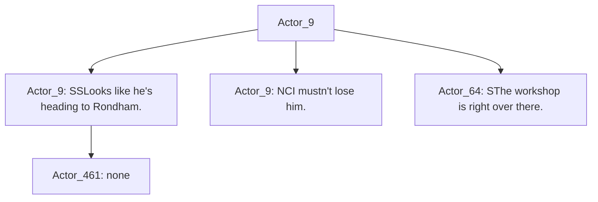

# Trachi/Central/Hudsman Corner/EV027

```mermaid
graph TD
    523_0["Actor_9"]
    523_1["Actor_9: SSLooks like he's heading to Rondham."]
    523_2["Actor_461: none"]
    523_3["Actor_9: NCI mustn't lose him."]
    523_4["Actor_64: SThe workshop is right over there."]
    523_0 --> 523_1
    523_0 --> 523_3
    523_0 --> 523_4
    523_1 --> 523_2
```