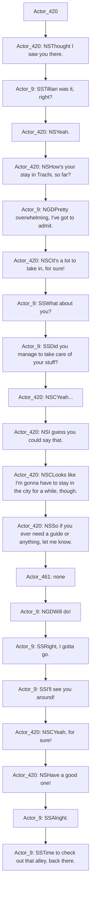

# Trachi/Central/Hudsman Corner/EV031

```mermaid
graph TD
    526_0["Actor_420"]
    526_1["Actor_420: NSThought I saw you there."]
    526_2["Actor_9: SSTillian was it, right?"]
    526_3["Actor_420: NSYeah."]
    526_4["Actor_420: NSHow's your stay in Trachi, so far?"]
    526_5["Actor_9: NGDPretty overwhelming, I've got to admit."]
    526_6["Actor_420: NSCIt's a lot to take in, for sure!"]
    526_7["Actor_9: SSWhat about you?"]
    526_8["Actor_9: SSDid you manage to take care of your stuff?"]
    526_9["Actor_420: NSCYeah..."]
    526_10["Actor_420: NSI guess you could say that."]
    526_11["Actor_420: NSCLooks like I'm gonna have to stay in the city for a while, though."]
    526_12["Actor_420: NSSo if you ever need a guide or anything, let me know."]
    526_13["Actor_461: none"]
    526_14["Actor_9: NGDWill do!"]
    526_15["Actor_9: SSRight, I gotta go."]
    526_16["Actor_9: SSI'll see you around!"]
    526_17["Actor_420: NSCYeah, for sure!"]
    526_18["Actor_420: NSHave a good one!"]
    526_19["Actor_9: SSAlright."]
    526_20["Actor_9: SSTime to check out that alley, back there."]
    526_0 --> 526_1
    526_1 --> 526_2
    526_2 --> 526_3
    526_3 --> 526_4
    526_4 --> 526_5
    526_5 --> 526_6
    526_6 --> 526_7
    526_7 --> 526_8
    526_8 --> 526_9
    526_9 --> 526_10
    526_10 --> 526_11
    526_11 --> 526_12
    526_12 --> 526_13
    526_13 --> 526_14
    526_14 --> 526_15
    526_15 --> 526_16
    526_16 --> 526_17
    526_17 --> 526_18
    526_18 --> 526_19
    526_19 --> 526_20
```