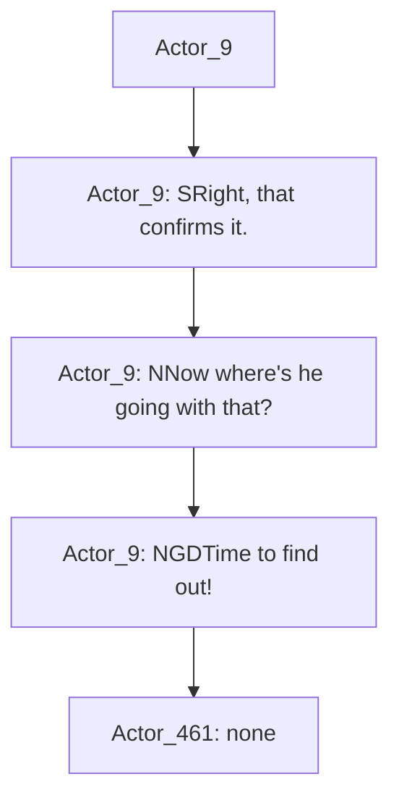

# Trachi/Central/Hudsman Corner/Galson Alley/Dead Drop

```mermaid
graph TD
    531_0["Actor_9"]
    531_1["Actor_9: SRight, that confirms it."]
    531_2["Actor_9: NNow where's he going with that?"]
    531_3["Actor_9: NGDTime to find out!"]
    531_4["Actor_461: none"]
    531_0 --> 531_1
    531_1 --> 531_2
    531_2 --> 531_3
    531_3 --> 531_4
```