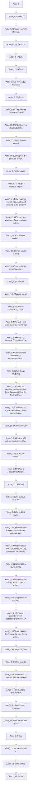

# Trachi/Central/Hudsman Corner/Galson Alley/Galson Alley 1925

```mermaid
graph TD
    532_0["Actor_5"]
    532_1["Actor_5: NSSee?"]
    532_2["Actor_5: NSI told you he'd show up."]
    532_3["Actor_13: NCOrpheus."]
    532_4["Actor_3: NAtlas."]
    532_5["Actor_13: NEury."]
    532_6["Actor_13: NI found your message."]
    532_7["Actor_5: NSGood."]
    532_8["Actor_5: NSAnd I'm glad you made it here."]
    532_9["Actor_13: NCI'd rather you skip the bullshit."]
    532_10["Actor_13: NAnd explain yourself."]
    532_11["Actor_5: NSStraight to the point, as always."]
    532_12["Actor_5: NCBut alright."]
    532_13["Actor_5: NI have a question for you."]
    532_14["Actor_5: NCDid Hyperion ever tell you who leaked your trip to the military?"]
    532_15["Actor_13: NCI don't see what any of that has to do with it."]
    532_16["Actor_13: SCAnd to be honest..."]
    532_17["Actor_13: SI think you're stalling."]
    532_18["Actor_5: NCYou really are something else..."]
    532_19["Actor_5: NIt was me."]
    532_20["Actor_13: SPWas it, now?"]
    532_21["Actor_5: NCNot on purpose, of course."]
    532_22["Actor_5: NPIn fact, I just found out a few weeks ago."]
    532_23["Actor_5: NPAnd only because Orpheus told me."]
    532_24["Actor_3: NCWhen I read her letter of recommendation..."]
    532_25["Actor_3: NTwo things struck me."]
    532_26["Actor_3: NCOne, her possible involvement in a false flag operation at the Fredrick Dam."]
    532_27["Actor_3: NPCAnd second, a note regarding a certain Lorna Faragó."]
    532_28["Actor_13: SWhat did it say?"]
    532_29["Actor_3: NA 21-year-old girl, serving in the military."]
    532_30["Actor_3: NCA trouble-maker."]
    532_31["Actor_3: NPCAnd a possible defector."]
    532_32["Actor_13: SPWhat?"]
    532_33["Actor_3: NCIt's curious, isn't it?"]
    532_34["Actor_3: NBut it didn't matter."]
    532_35["Actor_3: NCFero was very anxious about the thing with that dam."]
    532_36["Actor_3: NAnd since we knew EnKAD couldn't do that without the military..."]
    532_37["Actor_3: NCWe made a few inquiries."]
    532_38["Actor_3: NPCAnd told the military about Lorna, in return."]
    532_39["Actor_3: NPWe put her on the map."]
    532_40["Actor_3: NAs such, I consider myself responsible for her death."]
    532_41["Actor_3: NCEven though I didn't know she was Eury's sister..."]
    532_42["Actor_3: NI played my part."]
    532_43["Actor_5: NCAnd so did I."]
    532_44["Actor_5: NI've written a lot of letters, just like this one."]
    532_45["Actor_5: NCI should've known better."]
    532_46["Actor_5: NBut I trusted Hyperion."]
    532_47["Actor_13: SYou have it with you?"]
    532_48["Actor_3: SYup."]
    532_49["Actor_13: SPCLet me see it."]
    532_50["Actor_13: SPI'll kill him."]
    532_51["Actor_461: none"]
    532_0 --> 532_1
    532_1 --> 532_2
    532_2 --> 532_3
    532_3 --> 532_4
    532_4 --> 532_5
    532_5 --> 532_6
    532_6 --> 532_7
    532_7 --> 532_8
    532_8 --> 532_9
    532_9 --> 532_10
    532_10 --> 532_11
    532_11 --> 532_12
    532_12 --> 532_13
    532_13 --> 532_14
    532_14 --> 532_15
    532_15 --> 532_16
    532_16 --> 532_17
    532_17 --> 532_18
    532_18 --> 532_19
    532_19 --> 532_20
    532_20 --> 532_21
    532_21 --> 532_22
    532_22 --> 532_23
    532_23 --> 532_24
    532_24 --> 532_25
    532_25 --> 532_26
    532_26 --> 532_27
    532_27 --> 532_28
    532_28 --> 532_29
    532_29 --> 532_30
    532_30 --> 532_31
    532_31 --> 532_32
    532_32 --> 532_33
    532_33 --> 532_34
    532_34 --> 532_35
    532_35 --> 532_36
    532_36 --> 532_37
    532_37 --> 532_38
    532_38 --> 532_39
    532_39 --> 532_40
    532_40 --> 532_41
    532_41 --> 532_42
    532_42 --> 532_43
    532_43 --> 532_44
    532_44 --> 532_45
    532_45 --> 532_46
    532_46 --> 532_47
    532_47 --> 532_48
    532_48 --> 532_49
    532_49 --> 532_50
    532_50 --> 532_51
```