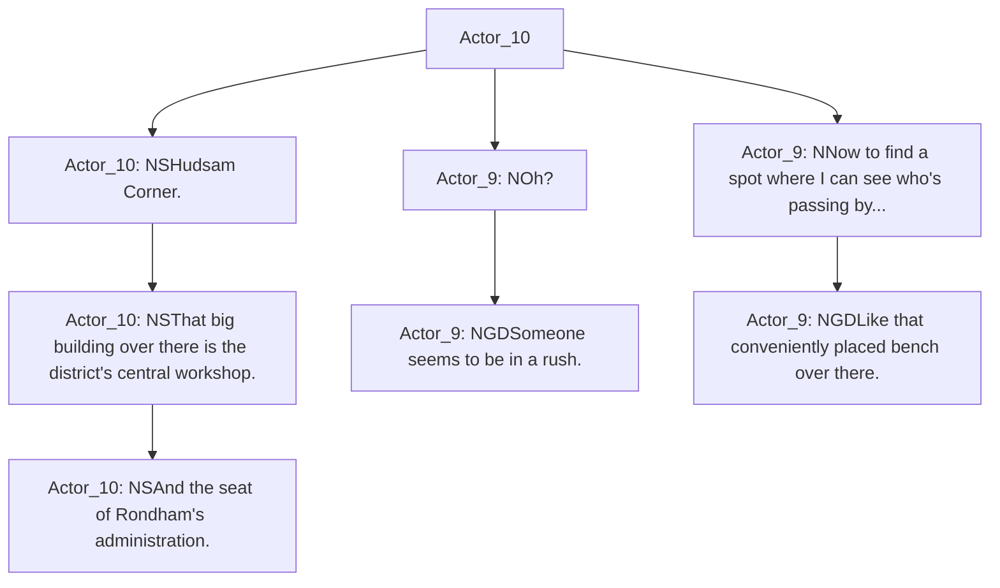

# Trachi/Central/Hudsman Corner/Intro Factory

```mermaid
graph TD
    533_0["Actor_10"]
    533_1["Actor_10: NSHudsam Corner."]
    533_2["Actor_10: NSThat big building over there is the district's central workshop."]
    533_3["Actor_10: NSAnd the seat of Rondham's administration."]
    533_4["Actor_9: NOh?"]
    533_5["Actor_9: NGDSomeone seems to be in a rush."]
    533_6["Actor_9: NNow to find a spot where I can see who's passing by..."]
    533_7["Actor_9: NGDLike that conveniently placed bench over there."]
    533_0 --> 533_1
    533_0 --> 533_4
    533_0 --> 533_6
    533_1 --> 533_2
    533_2 --> 533_3
    533_4 --> 533_5
    533_6 --> 533_7
```