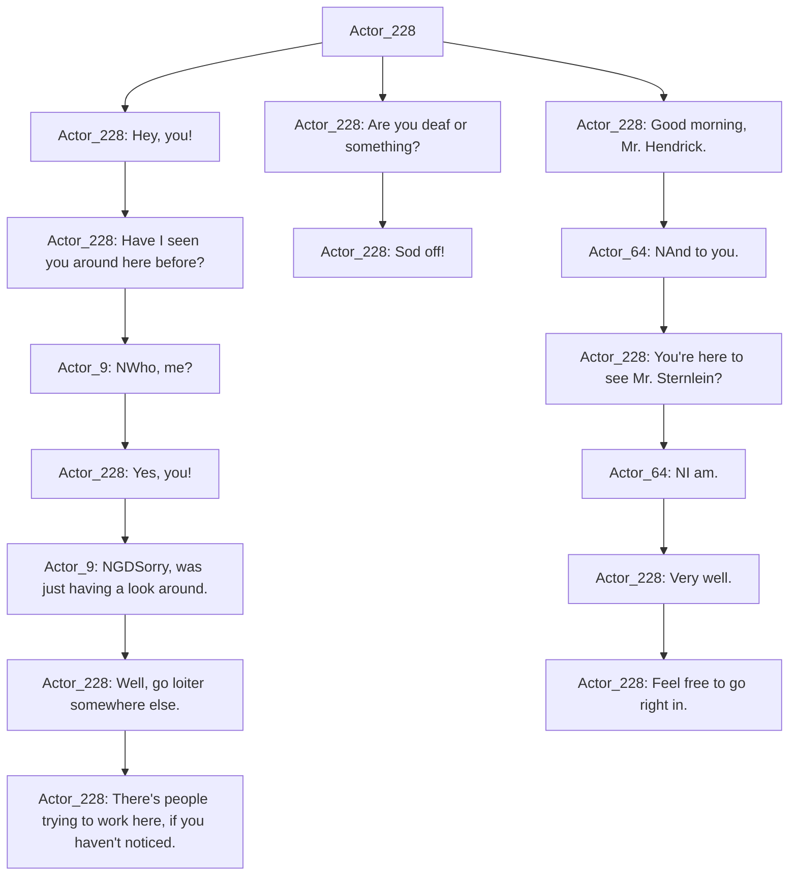

# Trachi/Central/Hudsman Corner/Workshop/EV011

```mermaid
graph TD
    534_0["Actor_228"]
    534_1["Actor_228: Hey, you!"]
    534_2["Actor_228: Have I seen you around here before?"]
    534_3["Actor_9: NWho, me?"]
    534_4["Actor_228: Yes, you!"]
    534_5["Actor_9: NGDSorry, was just having a look around."]
    534_6["Actor_228: Well, go loiter somewhere else."]
    534_7["Actor_228: There's people trying to work here, if you haven't noticed."]
    534_8["Actor_228: Are you deaf or something?"]
    534_9["Actor_228: Sod off!"]
    534_10["Actor_228: Good morning, Mr. Hendrick."]
    534_11["Actor_64: NAnd to you."]
    534_12["Actor_228: You're here to see Mr. Sternlein?"]
    534_13["Actor_64: NI am."]
    534_14["Actor_228: Very well."]
    534_15["Actor_228: Feel free to go right in."]
    534_0 --> 534_1
    534_0 --> 534_8
    534_0 --> 534_10
    534_1 --> 534_2
    534_2 --> 534_3
    534_3 --> 534_4
    534_4 --> 534_5
    534_5 --> 534_6
    534_6 --> 534_7
    534_8 --> 534_9
    534_10 --> 534_11
    534_11 --> 534_12
    534_12 --> 534_13
    534_13 --> 534_14
    534_14 --> 534_15
```