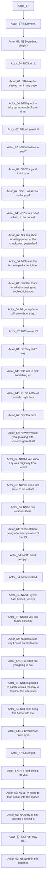

# Trachi/Central/Hudsman Corner/Workshop/Office/Sternlein Office

```mermaid
graph TD
    539_0["Actor_67"]
    539_1["Actor_67: NDrenem."]
    539_2["Actor_67: NSEverything alright?"]
    539_3["Actor_64: NCSort of."]
    539_4["Actor_64: NThanks for seeing me, in any case."]
    539_5["Actor_64: NI'll try not to take up too much of your time."]
    539_6["Actor_67: NDon't sweat it!"]
    539_7["Actor_67: NWant to take a seat?"]
    539_8["Actor_64: SPCI'm good, thank you."]
    539_9["Actor_67: NSo... what can I do for you?"]
    539_10["Actor_64: NCI'm in a bit of a bind, to be honest."]
    539_11["Actor_67: NIs this about what happened at the checkpoint, yesterday?"]
    539_12["Actor_64: NI'll raise the issue in parliament, later."]
    539_13["Actor_64: SPCBut that's not what's causing me trouble, right now."]
    539_14["Actor_64: NI got a phone call, a few hours ago."]
    539_15["Actor_67: NWho was it?"]
    539_16["Actor_64: SPThey didn't say."]
    539_17["Actor_64: SPCJust to pick something up."]
    539_18["Actor_64: SPThis bottle of Laronde, right here."]
    539_19["Actor_67: SPCDrenem..."]
    539_20["Actor_67: NSWhy would you go along with something like that?"]
    539_21["Actor_64: NCDid you know Lily was originally from Ionia?"]
    539_22["Actor_67: NWhat does that have to do with it?"]
    539_23["Actor_64: NShe has relatives there."]
    539_24["Actor_64: NOne of them being a former operative of the IIS."]
    539_25["Actor_64: NCIf I don't comply..."]
    539_26["Actor_64: NI'm finished."]
    539_27["Actor_64: NAnd Lily will hate herself, forever."]
    539_28["Actor_67: NSDid you talk to her about it?"]
    539_29["Actor_64: NCThere's no way I could break it to her."]
    539_30["Actor_67: NSo, what are you going to do?"]
    539_31["Actor_64: NI'm supposed to put this into a mailbox in Trenton, this afternoon."]
    539_32["Actor_64: NCI can't bring this home with me."]
    539_33["Actor_64: SPCYou know how Lily is."]
    539_34["Actor_67: NCAlright."]
    539_35["Actor_67: NI'll hold onto it, for you."]
    539_36["Actor_67: NBut I'm going to take a look into this matter."]
    539_37["Actor_67: NAnd try to find out who's behind it."]
    539_38["Actor_67: NCFrom now on..."]
    539_39["Actor_67: NSWe're in this together."]
    539_0 --> 539_1
    539_1 --> 539_2
    539_2 --> 539_3
    539_3 --> 539_4
    539_4 --> 539_5
    539_5 --> 539_6
    539_6 --> 539_7
    539_7 --> 539_8
    539_8 --> 539_9
    539_9 --> 539_10
    539_10 --> 539_11
    539_11 --> 539_12
    539_12 --> 539_13
    539_13 --> 539_14
    539_14 --> 539_15
    539_15 --> 539_16
    539_16 --> 539_17
    539_17 --> 539_18
    539_18 --> 539_19
    539_19 --> 539_20
    539_20 --> 539_21
    539_21 --> 539_22
    539_22 --> 539_23
    539_23 --> 539_24
    539_24 --> 539_25
    539_25 --> 539_26
    539_26 --> 539_27
    539_27 --> 539_28
    539_28 --> 539_29
    539_29 --> 539_30
    539_30 --> 539_31
    539_31 --> 539_32
    539_32 --> 539_33
    539_33 --> 539_34
    539_34 --> 539_35
    539_35 --> 539_36
    539_36 --> 539_37
    539_37 --> 539_38
    539_38 --> 539_39
```