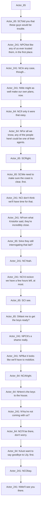

# Trachi/Central/Old Admirality/Admin/Backroom/Second Level/Eastern Wing/EV007

```mermaid
graph TD
    540_0["Actor_65"]
    540_1["Actor_65: SCTold you that these guys would be trouble."]
    540_2["Actor_241: NPCNot like any of us ever trusted them, in the first place."]
    540_3["Actor_241: NCIn any case, though..."]
    540_4["Actor_241: NWe might as well make our own plans, now."]
    540_5["Actor_64: NCIf only it were that easy."]
    540_6["Actor_64: NFor all we know, any of the people here\ could be one of their agents."]
    540_7["Actor_65: SCRight."]
    540_8["Actor_65: SCWe need to make sure the coast is clear, first."]
    540_9["Actor_241: NCI don't think we'll have time for that."]
    540_10["Actor_241: NFrom what Kristofor said, they're incredibly close."]
    540_11["Actor_65: SAre they still interrogating that lad?"]
    540_12["Actor_241: NCYeah."]
    540_13["Actor_241: NCI'd reckon we have a few hours left, at most."]
    540_14["Actor_65: SCI see."]
    540_15["Actor_65: SWant me to get the boys ready?"]
    540_16["Actor_241: NPCIt's a shame really."]
    540_17["Actor_241: NPBut it looks like we'll have to mobilize."]
    540_18["Actor_64: NCAlright."]
    540_19["Actor_64: NHere's the keys to the house."]
    540_20["Actor_241: NYou're not coming with us?"]
    540_21["Actor_64: NCI'll be there, don't worry."]
    540_22["Actor_64: NJust want to say goodbye to Lily, first."]
    540_23["Actor_241: NCOkay."]
    540_24["Actor_241: NWe'll see you there."]
    540_0 --> 540_1
    540_1 --> 540_2
    540_2 --> 540_3
    540_3 --> 540_4
    540_4 --> 540_5
    540_5 --> 540_6
    540_6 --> 540_7
    540_7 --> 540_8
    540_8 --> 540_9
    540_9 --> 540_10
    540_10 --> 540_11
    540_11 --> 540_12
    540_12 --> 540_13
    540_13 --> 540_14
    540_14 --> 540_15
    540_15 --> 540_16
    540_16 --> 540_17
    540_17 --> 540_18
    540_18 --> 540_19
    540_19 --> 540_20
    540_20 --> 540_21
    540_21 --> 540_22
    540_22 --> 540_23
    540_23 --> 540_24
```