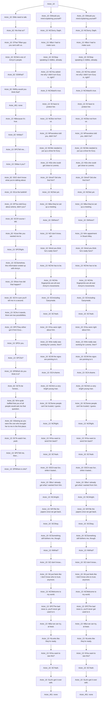

# Trachi/Central/Old Admirality/Admin/Backroom/Second Level/Harbourmaster's office/EV002

```mermaid
graph TD
    541_0["Actor_10"]
    541_1["Actor_10: SWe need to talk."]
    541_2["Actor_62: NIs that so?"]
    541_3["Actor_10: SThat Tillian guy you sent with us."]
    541_4["Actor_10: SCHe's one of Amryn's people."]
    541_5["Actor_62: SSWhat?"]
    541_6["Actor_62: NWhy would you think that?"]
    541_7["Actor_461: none"]
    541_8["Actor_13: NBecause it's true."]
    541_9["Actor_62: NAtlas?"]
    541_10["Actor_13: SPCTell me..."]
    541_11["Actor_13: SWas it you?"]
    541_12["Actor_62: SSCI don't know what you're talking about."]
    541_13["Actor_13: SCut the bullshit!"]
    541_14["Actor_13: SPYou told Eury about arteria, didn't you?"]
    541_15["Actor_62: SCOf course I did."]
    541_16["Actor_62: NJust like you wanted me to."]
    541_17["Actor_13: SPCRight."]
    541_18["Actor_13: SCSomehow, this information ended up with Amryn."]
    541_19["Actor_13: SNow how did that happen?"]
    541_20["Actor_62: SCI'm sure you'll tell me in a second."]
    541_21["Actor_13: SCAs it stands, there are two possibilities."]
    541_22["Actor_13: SPCThey either got it from Eury..."]
    541_23["Actor_13: SPOr you."]
    541_24["Actor_13: SPCSo?"]
    541_25["Actor_13: SPWhich do you think it is?"]
    541_26["Actor_62: SCTo be honest..."]
    541_27["Actor_62: NI'm quite baffled that you of all people would ask me that question."]
    541_28["Actor_62: SSeeing as you were the one who brought her to me in the first place."]
    541_29["Actor_13: SCTo watch her, yeah."]
    541_30["Actor_13: SPCTell me, then..."]
    541_31["Actor_13: SPWhere is she?"]
    541_32["Actor_10: SWould you mind explaining yourself?"]
    541_33["Actor_13: NCSorry, Daph."]
    541_34["Actor_13: NBut I had to make sure."]
    541_35["Actor_10: SCStop speaking in riddles, already."]
    541_36["Actor_13: NCYou asked me why I didn't turn Eury in, right?"]
    541_37["Actor_0: NCAtlasIt's true."]
    541_38["Actor_13: NI have to protect her."]
    541_39["Actor_13: NCBut not from us."]
    541_40["Actor_13: NPravoskos told you, didn't he?"]
    541_41["Actor_13: NCWe needed to put up a show for Eury."]
    541_42["Actor_13: NSo she could get close to Lorentz."]
    541_43["Actor_10: SAnd? Did she find him?"]
    541_44["Actor_13: NCNot yet."]
    541_45["Actor_13: NBut they've set up a meeting."]
    541_46["Actor_10: SWhere?"]
    541_47["Actor_13: NCI don't know, yet."]
    541_48["Actor_10: SAnd you think he's really here?"]
    541_49["Actor_13: NCHe has to be."]
    541_50["Actor_13: NCHis fingerprints are all over Amryn's movements"]
    541_51["Actor_13: SCIncluding Ganymede."]
    541_52["Actor_10: SCYeah."]
    541_53["Actor_10: SYou were right about him."]
    541_54["Actor_13: NHe really was working for Lorentz, then?"]
    541_55["Actor_10: SCAll the signs are pointing to it."]
    541_56["Actor_13: SCA shame."]
    541_57["Actor_13: NCHe's a very bright young man."]
    541_58["Actor_10: SCSome people can't be trusted, I guess."]
    541_59["Actor_13: NCRight."]
    541_60["Actor_13: NYou want to send him back?"]
    541_61["Actor_10: SCYeah."]
    541_62["Actor_10: SSCIt was fun, while it lasted..."]
    541_63["Actor_10: SBut I already got what I wanted from him."]
    541_64["Actor_13: NCAlright."]
    541_65["Actor_13: NI'll file the papers once we get back."]
    541_66["Actor_10: SCOkay."]
    541_67["Actor_10: SCSomething still bothers me, though."]
    541_68["Actor_13: NWhat?"]
    541_69["Actor_10: SCI don't know..."]
    541_70["Actor_10: SIt just feels like I don't know who to trust, anymore."]
    541_71["Actor_13: NCWelcome to my world."]
    541_72["Actor_13: SPCThe bad news is, you'll never get used to it."]
    541_73["Actor_13: NBut we can try, at least."]
    541_74["Actor_13: NLooks like they're ready."]
    541_75["Actor_13: NYou want to see this?"]
    541_76["Actor_10: SCYeah."]
    541_77["Actor_10: SLet's get it over with."]
    541_78["Actor_461: none"]
    541_79["Actor_10: SWould you mind explaining yourself?"]
    541_80["Actor_13: NCSorry, Daph."]
    541_81["Actor_13: NBut I had to make sure."]
    541_82["Actor_10: SCStop speaking in riddles, already."]
    541_83["Actor_13: NCYou asked me why I didn't turn Eury in, right?"]
    541_84["Actor_0: NCAtlasIt's true."]
    541_85["Actor_13: NI have to protect her."]
    541_86["Actor_13: NCBut not from us."]
    541_87["Actor_13: NPravoskos told you, didn't he?"]
    541_88["Actor_13: NCWe needed to put up a show for Eury."]
    541_89["Actor_13: NSo she could get close to Lorentz."]
    541_90["Actor_10: SAnd? Did she find him?"]
    541_91["Actor_13: NCNot yet."]
    541_92["Actor_13: NBut they've set up a meeting."]
    541_93["Actor_10: SWhere?"]
    541_94["Actor_13: NAn appartment in Stuart Alley."]
    541_95["Actor_10: SAnd you think he's really here?"]
    541_96["Actor_13: NCHe has to be."]
    541_97["Actor_13: NCHis fingerprints are all over Amryn's movements"]
    541_98["Actor_13: SCIncluding Ganymede."]
    541_99["Actor_10: SCYeah."]
    541_100["Actor_10: SYou were right about him."]
    541_101["Actor_13: NHe really was working for Lorentz, then?"]
    541_102["Actor_10: SCAll the signs are pointing to it."]
    541_103["Actor_13: SCA shame."]
    541_104["Actor_13: NCHe's a very bright young man."]
    541_105["Actor_10: SCSome people can't be trusted, I guess."]
    541_106["Actor_13: NCRight."]
    541_107["Actor_13: NYou want to send him back?"]
    541_108["Actor_10: SCYeah."]
    541_109["Actor_10: SSCIt was fun, while it lasted..."]
    541_110["Actor_10: SBut I already got what I wanted from him."]
    541_111["Actor_13: NCAlright."]
    541_112["Actor_13: NI'll file the papers once we get back."]
    541_113["Actor_10: SCOkay."]
    541_114["Actor_10: SCSomething still bothers me, though."]
    541_115["Actor_13: NWhat?"]
    541_116["Actor_10: SCI don't know..."]
    541_117["Actor_10: SIt just feels like I don't know who to trust, anymore."]
    541_118["Actor_13: NCWelcome to my world."]
    541_119["Actor_13: SPCThe bad news is, you'll never get used to it."]
    541_120["Actor_13: NBut we can try, at least."]
    541_121["Actor_13: NLooks like they're ready."]
    541_122["Actor_13: NYou want to see this?"]
    541_123["Actor_10: SCYeah."]
    541_124["Actor_10: SLet's get it over with."]
    541_125["Actor_461: none"]
    541_0 --> 541_1
    541_0 --> 541_32
    541_0 --> 541_79
    541_1 --> 541_2
    541_2 --> 541_3
    541_3 --> 541_4
    541_4 --> 541_5
    541_5 --> 541_6
    541_6 --> 541_7
    541_7 --> 541_8
    541_8 --> 541_9
    541_9 --> 541_10
    541_10 --> 541_11
    541_11 --> 541_12
    541_12 --> 541_13
    541_13 --> 541_14
    541_14 --> 541_15
    541_15 --> 541_16
    541_16 --> 541_17
    541_17 --> 541_18
    541_18 --> 541_19
    541_19 --> 541_20
    541_20 --> 541_21
    541_21 --> 541_22
    541_22 --> 541_23
    541_23 --> 541_24
    541_24 --> 541_25
    541_25 --> 541_26
    541_26 --> 541_27
    541_27 --> 541_28
    541_28 --> 541_29
    541_29 --> 541_30
    541_30 --> 541_31
    541_32 --> 541_33
    541_33 --> 541_34
    541_34 --> 541_35
    541_35 --> 541_36
    541_36 --> 541_37
    541_37 --> 541_38
    541_38 --> 541_39
    541_39 --> 541_40
    541_40 --> 541_41
    541_41 --> 541_42
    541_42 --> 541_43
    541_43 --> 541_44
    541_44 --> 541_45
    541_45 --> 541_46
    541_46 --> 541_47
    541_47 --> 541_48
    541_48 --> 541_49
    541_49 --> 541_50
    541_50 --> 541_51
    541_51 --> 541_52
    541_52 --> 541_53
    541_53 --> 541_54
    541_54 --> 541_55
    541_55 --> 541_56
    541_56 --> 541_57
    541_57 --> 541_58
    541_58 --> 541_59
    541_59 --> 541_60
    541_60 --> 541_61
    541_61 --> 541_62
    541_62 --> 541_63
    541_63 --> 541_64
    541_64 --> 541_65
    541_65 --> 541_66
    541_66 --> 541_67
    541_67 --> 541_68
    541_68 --> 541_69
    541_69 --> 541_70
    541_70 --> 541_71
    541_71 --> 541_72
    541_72 --> 541_73
    541_73 --> 541_74
    541_74 --> 541_75
    541_75 --> 541_76
    541_76 --> 541_77
    541_77 --> 541_78
    541_79 --> 541_80
    541_80 --> 541_81
    541_81 --> 541_82
    541_82 --> 541_83
    541_83 --> 541_84
    541_84 --> 541_85
    541_85 --> 541_86
    541_86 --> 541_87
    541_87 --> 541_88
    541_88 --> 541_89
    541_89 --> 541_90
    541_90 --> 541_91
    541_91 --> 541_92
    541_92 --> 541_93
    541_93 --> 541_94
    541_94 --> 541_95
    541_95 --> 541_96
    541_96 --> 541_97
    541_97 --> 541_98
    541_98 --> 541_99
    541_99 --> 541_100
    541_100 --> 541_101
    541_101 --> 541_102
    541_102 --> 541_103
    541_103 --> 541_104
    541_104 --> 541_105
    541_105 --> 541_106
    541_106 --> 541_107
    541_107 --> 541_108
    541_108 --> 541_109
    541_109 --> 541_110
    541_110 --> 541_111
    541_111 --> 541_112
    541_112 --> 541_113
    541_113 --> 541_114
    541_114 --> 541_115
    541_115 --> 541_116
    541_116 --> 541_117
    541_117 --> 541_118
    541_118 --> 541_119
    541_119 --> 541_120
    541_120 --> 541_121
    541_121 --> 541_122
    541_122 --> 541_123
    541_123 --> 541_124
    541_124 --> 541_125
```