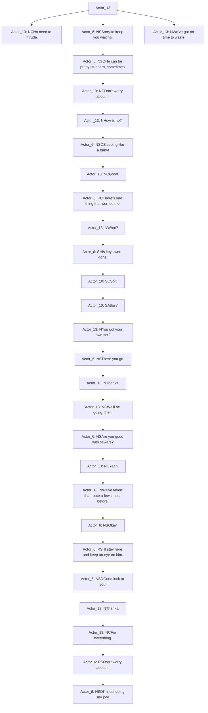

# Trachi/Central/Old Admirality/Admin/Backroom/Second Level/Western Wing/EV004

```mermaid
graph TD
    543_0["Actor_13"]
    543_1["Actor_13: NCNo need to intrude."]
    543_2["Actor_6: NSSorry to keep you waiting."]
    543_3["Actor_6: NSDHe can be pretty stubborn, sometimes."]
    543_4["Actor_13: NCDon't worry about it."]
    543_5["Actor_13: NHow is he?"]
    543_6["Actor_6: NSDSleeping like a baby!"]
    543_7["Actor_13: NCGood."]
    543_8["Actor_6: RCThere's one thing that worries me."]
    543_9["Actor_13: NWhat?"]
    543_10["Actor_6: SHis keys were gone."]
    543_11["Actor_10: SCShit."]
    543_12["Actor_10: SAtlas?"]
    543_13["Actor_13: NYou got your own set?"]
    543_14["Actor_6: NSThere you go."]
    543_15["Actor_13: NThanks."]
    543_16["Actor_13: NCWe'll be going, then."]
    543_17["Actor_6: NSAre you good with sewers?"]
    543_18["Actor_13: NCYeah."]
    543_19["Actor_13: NWe've taken that route a few times, before."]
    543_20["Actor_6: NSOkay."]
    543_21["Actor_6: RSI'll stay here and keep an eye on him."]
    543_22["Actor_6: NSDGood luck to you!"]
    543_23["Actor_13: NThanks."]
    543_24["Actor_13: NCFor everything."]
    543_25["Actor_6: RSDon't worry about it."]
    543_26["Actor_6: NSDI'm just doing my job!"]
    543_27["Actor_13: NWe've got no time to waste."]
    543_0 --> 543_1
    543_0 --> 543_2
    543_0 --> 543_27
    543_2 --> 543_3
    543_3 --> 543_4
    543_4 --> 543_5
    543_5 --> 543_6
    543_6 --> 543_7
    543_7 --> 543_8
    543_8 --> 543_9
    543_9 --> 543_10
    543_10 --> 543_11
    543_11 --> 543_12
    543_12 --> 543_13
    543_13 --> 543_14
    543_14 --> 543_15
    543_15 --> 543_16
    543_16 --> 543_17
    543_17 --> 543_18
    543_18 --> 543_19
    543_19 --> 543_20
    543_20 --> 543_21
    543_21 --> 543_22
    543_22 --> 543_23
    543_23 --> 543_24
    543_24 --> 543_25
    543_25 --> 543_26
```