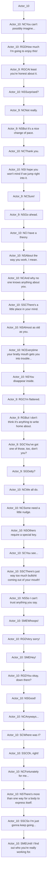

# Trachi/Central/Old Admirality/Admin/Cellar/Archives/Daphne Lily

```mermaid
graph TD
    545_0["Actor_10"]
    545_1["Actor_10: NCYou can't possibly imagine..."]
    545_2["Actor_10: RGDHow much I'm going to enjoy this!"]
    545_3["Actor_9: RGCAt least you're honest about it."]
    545_4["Actor_10: NSSurprised?"]
    545_5["Actor_9: NCNot really."]
    545_6["Actor_9: NSBut it's a nice change of pace."]
    545_7["Actor_10: NCThank you."]
    545_8["Actor_10: NSI hope you won't mind if we jump right into it."]
    545_9["Actor_9: NCSure!"]
    545_10["Actor_9: NSGo ahead."]
    545_11["Actor_10: NCI have a theory."]
    545_12["Actor_10: NSAbout the way you work, I mean."]
    545_13["Actor_10: NCAnd why no one knows anything about you."]
    545_14["Actor_10: SSCThere's a little place in your mind."]
    545_15["Actor_10: NSAlmost as old as you."]
    545_16["Actor_10: NCEverytime your bratty mouth gets you into trouble..."]
    545_17["Actor_10: NSYou disappear inside."]
    545_18["Actor_9: RGCI'm flattered."]
    545_19["Actor_9: RGBut I don't think it's anything to write home about."]
    545_20["Actor_9: SGCYou've got one of those, too, don't you?"]
    545_21["Actor_9: SGDotty?"]
    545_22["Actor_10: NCWe all do."]
    545_23["Actor_10: NCSome need a little nudge."]
    545_24["Actor_10: NSOthers require a special key."]
    545_25["Actor_10: SCYou see..."]
    545_26["Actor_10: SSCThere's just way too much bullshit coming out of your mouth!"]
    545_27["Actor_10: NSSo I can't trust anything you say."]
    545_28["Actor_10: SMEWhoops!"]
    545_29["Actor_10: RGDVery sorry!"]
    545_30["Actor_10: SMEHey!"]
    545_31["Actor_10: RGDYou okay, down there?"]
    545_32["Actor_10: NSGood!"]
    545_33["Actor_10: NCAnyways..."]
    545_34["Actor_10: SCWhere was I?"]
    545_35["Actor_10: SSCOh, right!"]
    545_36["Actor_10: NCFortunately for me..."]
    545_37["Actor_10: NSThere's more than one way for a body to express itself."]
    545_38["Actor_10: SSCSo I'm just gonna keep going..."]
    545_39["Actor_10: SMEUntil I find out who you're really working for."]
    545_0 --> 545_1
    545_1 --> 545_2
    545_2 --> 545_3
    545_3 --> 545_4
    545_4 --> 545_5
    545_5 --> 545_6
    545_6 --> 545_7
    545_7 --> 545_8
    545_8 --> 545_9
    545_9 --> 545_10
    545_10 --> 545_11
    545_11 --> 545_12
    545_12 --> 545_13
    545_13 --> 545_14
    545_14 --> 545_15
    545_15 --> 545_16
    545_16 --> 545_17
    545_17 --> 545_18
    545_18 --> 545_19
    545_19 --> 545_20
    545_20 --> 545_21
    545_21 --> 545_22
    545_22 --> 545_23
    545_23 --> 545_24
    545_24 --> 545_25
    545_25 --> 545_26
    545_26 --> 545_27
    545_27 --> 545_28
    545_28 --> 545_29
    545_29 --> 545_30
    545_30 --> 545_31
    545_31 --> 545_32
    545_32 --> 545_33
    545_33 --> 545_34
    545_34 --> 545_35
    545_35 --> 545_36
    545_36 --> 545_37
    545_37 --> 545_38
    545_38 --> 545_39
```