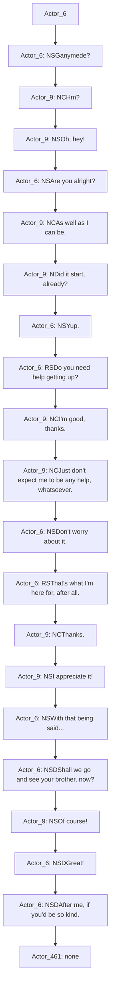

# Trachi/Central/Old Admirality/Admin/Cellar/Archives/EV001

```mermaid
graph TD
    546_0["Actor_6"]
    546_1["Actor_6: NSGanymede?"]
    546_2["Actor_9: NCHm?"]
    546_3["Actor_9: NSOh, hey!"]
    546_4["Actor_6: NSAre you alright?"]
    546_5["Actor_9: NCAs well as I can be."]
    546_6["Actor_9: NDid it start, already?"]
    546_7["Actor_6: NSYup."]
    546_8["Actor_6: RSDo you need help getting up?"]
    546_9["Actor_9: NCI'm good, thanks."]
    546_10["Actor_9: NCJust don't expect me to be any help, whatsoever."]
    546_11["Actor_6: NSDon't worry about it."]
    546_12["Actor_6: RSThat's what I'm here for, after all."]
    546_13["Actor_9: NCThanks."]
    546_14["Actor_9: NSI appreciate it!"]
    546_15["Actor_6: NSWith that being said..."]
    546_16["Actor_6: NSDShall we go and see your brother, now?"]
    546_17["Actor_9: NSOf course!"]
    546_18["Actor_6: NSDGreat!"]
    546_19["Actor_6: NSDAfter me, if you'd be so kind."]
    546_20["Actor_461: none"]
    546_0 --> 546_1
    546_1 --> 546_2
    546_2 --> 546_3
    546_3 --> 546_4
    546_4 --> 546_5
    546_5 --> 546_6
    546_6 --> 546_7
    546_7 --> 546_8
    546_8 --> 546_9
    546_9 --> 546_10
    546_10 --> 546_11
    546_11 --> 546_12
    546_12 --> 546_13
    546_13 --> 546_14
    546_14 --> 546_15
    546_15 --> 546_16
    546_16 --> 546_17
    546_17 --> 546_18
    546_18 --> 546_19
    546_19 --> 546_20
```