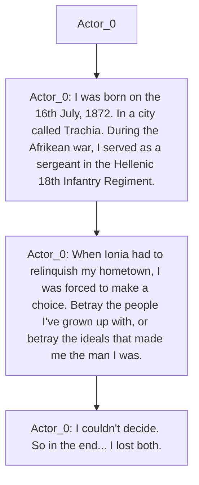

# Trachi/Central/Old Admirality/Admin/Cellar/Archives/EV005

```mermaid
graph TD
    547_0["Actor_0"]
    547_1["Actor_0: I was born on the 16th July, 1872. In a city called Trachia. During the Afrikean war, I served as a sergeant in the Hellenic 18th Infantry Regiment."]
    547_2["Actor_0: When Ionia had to relinquish my hometown, I was forced to make a choice. Betray the people I've grown up with, or betray the ideals that made me the man I was."]
    547_3["Actor_0: I couldn't decide. So in the end... I lost both."]
    547_0 --> 547_1
    547_1 --> 547_2
    547_2 --> 547_3
```