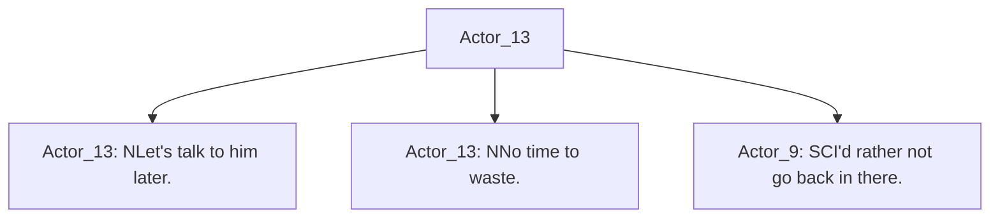

# Trachi/Central/Old Admirality/Admin/Cellar/EV003

```mermaid
graph TD
    548_0["Actor_13"]
    548_1["Actor_13: NLet's talk to him later."]
    548_2["Actor_13: NNo time to waste."]
    548_3["Actor_9: SCI'd rather not go back in there."]
    548_0 --> 548_1
    548_0 --> 548_2
    548_0 --> 548_3
```