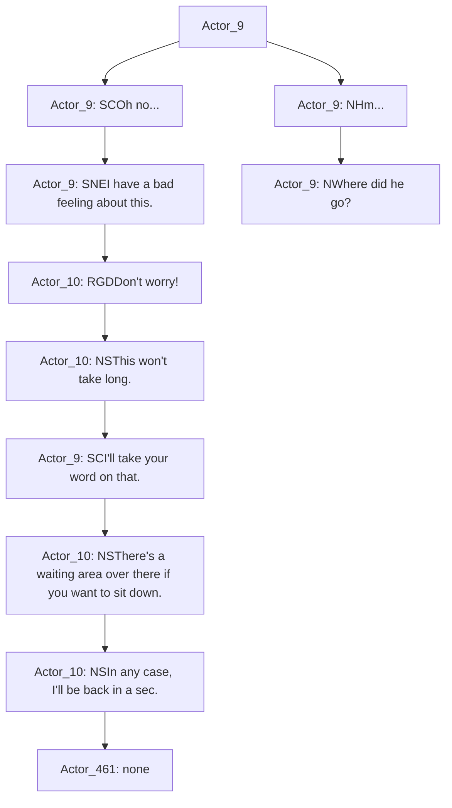

# Trachi/Central/Old Admirality/Admin/EV006

```mermaid
graph TD
    550_0["Actor_9"]
    550_1["Actor_9: SCOh no..."]
    550_2["Actor_9: SNEI have a bad feeling about this."]
    550_3["Actor_10: RGDDon't worry!"]
    550_4["Actor_10: NSThis won't take long."]
    550_5["Actor_9: SCI'll take your word on that."]
    550_6["Actor_10: NSThere's a waiting area over there if you want to sit down."]
    550_7["Actor_10: NSIn any case, I'll be back in a sec."]
    550_8["Actor_461: none"]
    550_9["Actor_9: NHm..."]
    550_10["Actor_9: NWhere did he go?"]
    550_0 --> 550_1
    550_0 --> 550_9
    550_1 --> 550_2
    550_2 --> 550_3
    550_3 --> 550_4
    550_4 --> 550_5
    550_5 --> 550_6
    550_6 --> 550_7
    550_7 --> 550_8
    550_9 --> 550_10
```