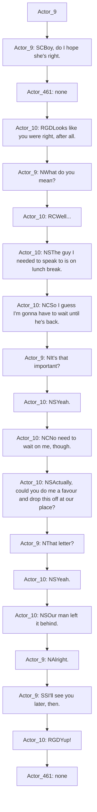

# Trachi/Central/Old Admirality/Admin/EV023

```mermaid
graph TD
    555_0["Actor_9"]
    555_1["Actor_9: SCBoy, do I hope she's right."]
    555_2["Actor_461: none"]
    555_3["Actor_10: RGDLooks like you were right, after all."]
    555_4["Actor_9: NWhat do you mean?"]
    555_5["Actor_10: RCWell..."]
    555_6["Actor_10: NSThe guy I needed to speak to is on lunch break."]
    555_7["Actor_10: NCSo I guess I'm gonna have to wait until he's back."]
    555_8["Actor_9: NIt's that important?"]
    555_9["Actor_10: NSYeah."]
    555_10["Actor_10: NCNo need to wait on me, though."]
    555_11["Actor_10: NSActually, could you do me a favour and drop this off at our place?"]
    555_12["Actor_9: NThat letter?"]
    555_13["Actor_10: NSYeah."]
    555_14["Actor_10: NSOur man left it behind."]
    555_15["Actor_9: NAlright."]
    555_16["Actor_9: SSI'll see you later, then."]
    555_17["Actor_10: RGDYup!"]
    555_18["Actor_461: none"]
    555_0 --> 555_1
    555_1 --> 555_2
    555_2 --> 555_3
    555_3 --> 555_4
    555_4 --> 555_5
    555_5 --> 555_6
    555_6 --> 555_7
    555_7 --> 555_8
    555_8 --> 555_9
    555_9 --> 555_10
    555_10 --> 555_11
    555_11 --> 555_12
    555_12 --> 555_13
    555_13 --> 555_14
    555_14 --> 555_15
    555_15 --> 555_16
    555_16 --> 555_17
    555_17 --> 555_18
```