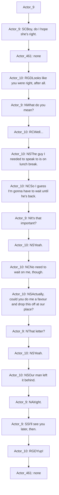

# Trachi/Central/Old Admirality/Admin/EV024

```mermaid
graph TD
    556_0["Actor_9"]
    556_1["Actor_9: SCBoy, do I hope she's right."]
    556_2["Actor_461: none"]
    556_3["Actor_10: RGDLooks like you were right, after all."]
    556_4["Actor_9: NWhat do you mean?"]
    556_5["Actor_10: RCWell..."]
    556_6["Actor_10: NSThe guy I needed to speak to is on lunch break."]
    556_7["Actor_10: NCSo I guess I'm gonna have to wait until he's back."]
    556_8["Actor_9: NIt's that important?"]
    556_9["Actor_10: NSYeah."]
    556_10["Actor_10: NCNo need to wait on me, though."]
    556_11["Actor_10: NSActually, could you do me a favour and drop this off at our place?"]
    556_12["Actor_9: NThat letter?"]
    556_13["Actor_10: NSYeah."]
    556_14["Actor_10: NSOur man left it behind."]
    556_15["Actor_9: NAlright."]
    556_16["Actor_9: SSI'll see you later, then."]
    556_17["Actor_10: RGDYup!"]
    556_18["Actor_461: none"]
    556_0 --> 556_1
    556_1 --> 556_2
    556_2 --> 556_3
    556_3 --> 556_4
    556_4 --> 556_5
    556_5 --> 556_6
    556_6 --> 556_7
    556_7 --> 556_8
    556_8 --> 556_9
    556_9 --> 556_10
    556_10 --> 556_11
    556_11 --> 556_12
    556_12 --> 556_13
    556_13 --> 556_14
    556_14 --> 556_15
    556_15 --> 556_16
    556_16 --> 556_17
    556_17 --> 556_18
```