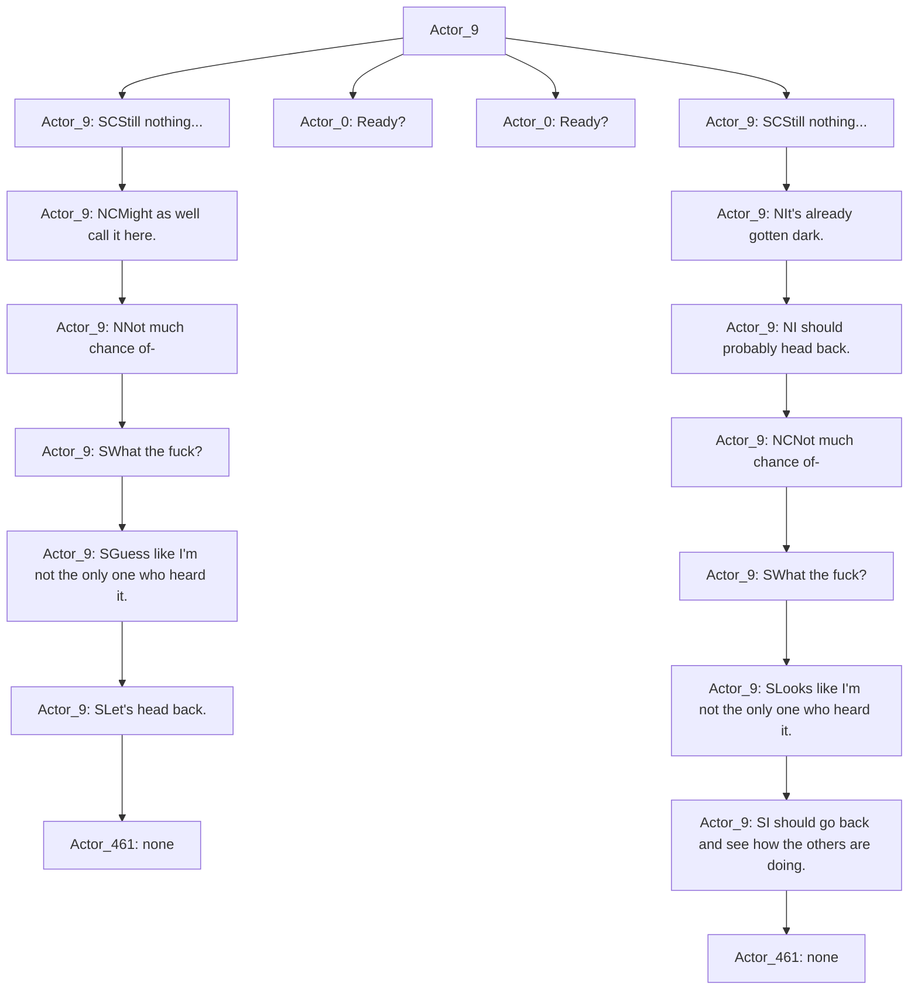

# Trachi/Central/Old Admirality/EV023

```mermaid
graph TD
    557_0["Actor_9"]
    557_1["Actor_9: SCStill nothing..."]
    557_2["Actor_9: NCMight as well call it here."]
    557_3["Actor_9: NNot much chance of-"]
    557_4["Actor_9: SWhat the fuck?"]
    557_5["Actor_9: SGuess like I'm not the only one who heard it."]
    557_6["Actor_9: SLet's head back."]
    557_7["Actor_461: none"]
    557_8["Actor_0: Ready?"]
    557_9["Actor_0: Ready?"]
    557_10["Actor_9: SCStill nothing..."]
    557_11["Actor_9: NIt's already gotten dark."]
    557_12["Actor_9: NI should probably head back."]
    557_13["Actor_9: NCNot much chance of-"]
    557_14["Actor_9: SWhat the fuck?"]
    557_15["Actor_9: SLooks like I'm not the only one who heard it."]
    557_16["Actor_9: SI should go back and see how the others are doing."]
    557_17["Actor_461: none"]
    557_0 --> 557_1
    557_0 --> 557_8
    557_0 --> 557_9
    557_0 --> 557_10
    557_1 --> 557_2
    557_2 --> 557_3
    557_3 --> 557_4
    557_4 --> 557_5
    557_5 --> 557_6
    557_6 --> 557_7
    557_10 --> 557_11
    557_11 --> 557_12
    557_12 --> 557_13
    557_13 --> 557_14
    557_14 --> 557_15
    557_15 --> 557_16
    557_16 --> 557_17
```