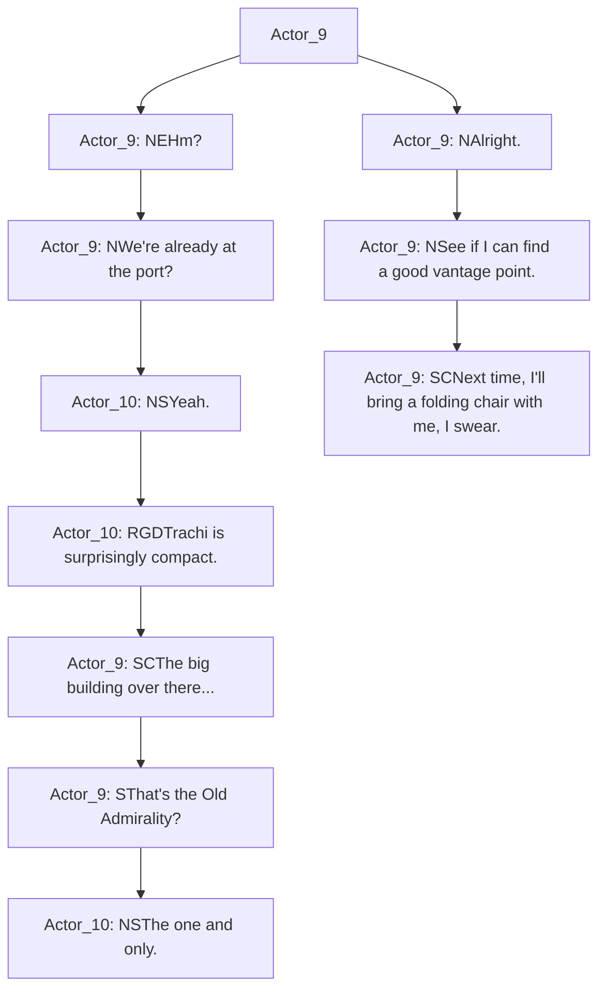

# Trachi/Central/Old Admirality/EV049

```mermaid
graph TD
    559_0["Actor_9"]
    559_1["Actor_9: NEHm?"]
    559_2["Actor_9: NWe're already at the port?"]
    559_3["Actor_10: NSYeah."]
    559_4["Actor_10: RGDTrachi is surprisingly compact."]
    559_5["Actor_9: SCThe big building over there..."]
    559_6["Actor_9: SThat's the Old Admirality?"]
    559_7["Actor_10: NSThe one and only."]
    559_8["Actor_9: NAlright."]
    559_9["Actor_9: NSee if I can find a good vantage point."]
    559_10["Actor_9: SCNext time, I'll bring a folding chair with me, I swear."]
    559_0 --> 559_1
    559_0 --> 559_8
    559_1 --> 559_2
    559_2 --> 559_3
    559_3 --> 559_4
    559_4 --> 559_5
    559_5 --> 559_6
    559_6 --> 559_7
    559_8 --> 559_9
    559_9 --> 559_10
```