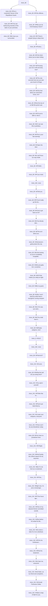

# Trachi/Central/Old Admirality/EV089

```mermaid
graph TD
    561_0["Actor_66"]
    561_1["Actor_66: NThis is Lieutenant Tanner of the Republican Guard."]
    561_2["Actor_66: NPCYou are harbouring enemies of the state on your premises."]
    561_3["Actor_66: NWe have you surrounded."]
    561_4["Actor_65: SPCNo offense..."]
    561_5["Actor_65: SPBut you lot mind keeping it down?"]
    561_6["Actor_65: SPCThere's people trying to sleep here."]
    561_7["Actor_66: NPJulius..."]
    561_8["Actor_66: NPCSo that's where you've been hiding."]
    561_9["Actor_66: NSThrowing your lot in with terrorists, now?"]
    561_10["Actor_65: SEThe only terrorists here are you and your bunch of thugs."]
    561_11["Actor_65: SSCSo how about you send them home, hm?"]
    561_12["Actor_65: SPAnd the two of us talk like grown-ups."]
    561_13["Actor_65: SPCIf you're able to, that is."]
    561_14["Actor_66: NSCI can see this is pointless."]
    561_15["Actor_66: NSThis is your last warning!"]
    561_16["Actor_66: NCOpen the door."]
    561_17["Actor_66: NOr we'll force our way inside."]
    561_18["Actor_65: SPCWell..."]
    561_19["Actor_65: SPIf you insist."]
    561_20["Actor_461: none"]
    561_21["Actor_65: SSTold you."]
    561_22["Actor_66: NPCYou'd really go this far..."]
    561_23["Actor_66: NPJust to get back at me?"]
    561_24["Actor_65: SSCYou bloody idiot..."]
    561_25["Actor_65: SEThis isn't about you."]
    561_26["Actor_65: SSSomeone's gotta protect this city."]
    561_27["Actor_65: SECAnd seeing as you're completely incapable..."]
    561_28["Actor_65: SSWe just gotta do it, ourselves."]
    561_29["Actor_66: NSCIf that makes you sleep at night."]
    561_30["Actor_66: NSBe my guest."]
    561_31["Actor_66: NCBut I won't stand by while there's insurgents running rampant."]
    561_32["Actor_66: NSo if it's war, you want..."]
    561_33["Actor_66: NECYou shall have it."]
    561_34["Actor_66: NEReady weapons, men!"]
    561_35["Actor_0: HOLD!"]
    561_36["Actor_461: none"]
    561_37["Actor_66: NPHeinrich?"]
    561_38["Actor_241: NCLouis."]
    561_39["Actor_66: NPWhat the hell are you doing here?"]
    561_40["Actor_241: NYou said it yourself."]
    561_41["Actor_241: NPCMen like us..."]
    561_42["Actor_241: NPCan't just stand idly by."]
    561_43["Actor_241: NCLower your weapons, everyone."]
    561_44["Actor_241: NThere won't be any bloodshed, today."]
    561_45["Actor_66: NSYou have no jurisdiction here."]
    561_46["Actor_241: NPCRight."]
    561_47["Actor_241: NPAnd frankly, the uniform doesn't fit me, anymore."]
    561_48["Actor_241: NBut I'm not here as a Lieutenant."]
    561_49["Actor_241: NPCNo..."]
    561_50["Actor_241: NRight now, I'm just a messenger."]
    561_51["Actor_241: NPCTwo hours ago..."]
    561_52["Actor_241: NPOne of my dearest friends committed suicide."]
    561_53["Actor_241: NCBut before he ended his life..."]
    561_54["Actor_241: NHe wrote a letter for me to distribute."]
    561_55["Actor_241: NPCIt's his confession..."]
    561_56["Actor_241: NPAnd his testament."]
    561_57["Actor_241: NSo hear me, everyone!"]
    561_58["Actor_241: NAnd listen, as my friend and compatriot..."]
    561_59["Actor_241: NCArnold Francesco Solka."]
    561_60["Actor_241: NTakes a leap of faith for you."]
    561_0 --> 561_1
    561_0 --> 561_4
    561_1 --> 561_2
    561_2 --> 561_3
    561_4 --> 561_5
    561_5 --> 561_6
    561_6 --> 561_7
    561_7 --> 561_8
    561_8 --> 561_9
    561_9 --> 561_10
    561_10 --> 561_11
    561_11 --> 561_12
    561_12 --> 561_13
    561_13 --> 561_14
    561_14 --> 561_15
    561_15 --> 561_16
    561_16 --> 561_17
    561_17 --> 561_18
    561_18 --> 561_19
    561_19 --> 561_20
    561_20 --> 561_21
    561_21 --> 561_22
    561_22 --> 561_23
    561_23 --> 561_24
    561_24 --> 561_25
    561_25 --> 561_26
    561_26 --> 561_27
    561_27 --> 561_28
    561_28 --> 561_29
    561_29 --> 561_30
    561_30 --> 561_31
    561_31 --> 561_32
    561_32 --> 561_33
    561_33 --> 561_34
    561_34 --> 561_35
    561_35 --> 561_36
    561_36 --> 561_37
    561_37 --> 561_38
    561_38 --> 561_39
    561_39 --> 561_40
    561_40 --> 561_41
    561_41 --> 561_42
    561_42 --> 561_43
    561_43 --> 561_44
    561_44 --> 561_45
    561_45 --> 561_46
    561_46 --> 561_47
    561_47 --> 561_48
    561_48 --> 561_49
    561_49 --> 561_50
    561_50 --> 561_51
    561_51 --> 561_52
    561_52 --> 561_53
    561_53 --> 561_54
    561_54 --> 561_55
    561_55 --> 561_56
    561_56 --> 561_57
    561_57 --> 561_58
    561_58 --> 561_59
    561_59 --> 561_60
```