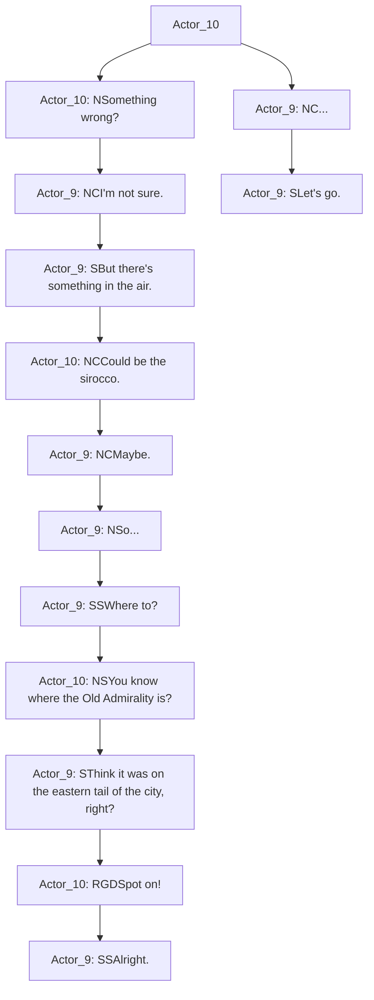

# Trachi/Central/Rondham Central/EV003

```mermaid
graph TD
    567_0["Actor_10"]
    567_1["Actor_10: NSomething wrong?"]
    567_2["Actor_9: NCI'm not sure."]
    567_3["Actor_9: SBut there's something in the air."]
    567_4["Actor_10: NCCould be the sirocco."]
    567_5["Actor_9: NCMaybe."]
    567_6["Actor_9: NSo..."]
    567_7["Actor_9: SSWhere to?"]
    567_8["Actor_10: NSYou know where the Old Admirality is?"]
    567_9["Actor_9: SThink it was on the eastern tail of the city, right?"]
    567_10["Actor_10: RGDSpot on!"]
    567_11["Actor_9: SSAlright."]
    567_12["Actor_9: NC..."]
    567_13["Actor_9: SLet's go."]
    567_0 --> 567_1
    567_0 --> 567_12
    567_1 --> 567_2
    567_2 --> 567_3
    567_3 --> 567_4
    567_4 --> 567_5
    567_5 --> 567_6
    567_6 --> 567_7
    567_7 --> 567_8
    567_8 --> 567_9
    567_9 --> 567_10
    567_10 --> 567_11
    567_12 --> 567_13
```