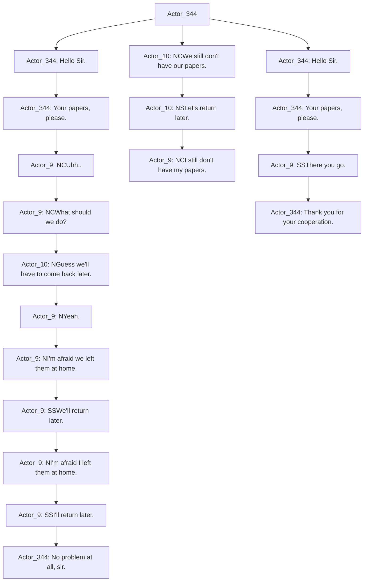

# Trachi/Central/Rondham Central/EV016

```mermaid
graph TD
    573_0["Actor_344"]
    573_1["Actor_344: Hello Sir."]
    573_2["Actor_344: Your papers, please."]
    573_3["Actor_9: NCUhh.."]
    573_4["Actor_9: NCWhat should we do?"]
    573_5["Actor_10: NGuess we'll have to come back later."]
    573_6["Actor_9: NYeah."]
    573_7["Actor_9: NI'm afraid we left them at home."]
    573_8["Actor_9: SSWe'll return later."]
    573_9["Actor_9: NI'm afraid I left them at home."]
    573_10["Actor_9: SSI'll return later."]
    573_11["Actor_344: No problem at all, sir."]
    573_12["Actor_10: NCWe still don't have our papers."]
    573_13["Actor_10: NSLet's return later."]
    573_14["Actor_9: NCI still don't have my papers."]
    573_15["Actor_344: Hello Sir."]
    573_16["Actor_344: Your papers, please."]
    573_17["Actor_9: SSThere you go."]
    573_18["Actor_344: Thank you for your cooperation."]
    573_0 --> 573_1
    573_0 --> 573_12
    573_0 --> 573_15
    573_1 --> 573_2
    573_2 --> 573_3
    573_3 --> 573_4
    573_4 --> 573_5
    573_5 --> 573_6
    573_6 --> 573_7
    573_7 --> 573_8
    573_8 --> 573_9
    573_9 --> 573_10
    573_10 --> 573_11
    573_12 --> 573_13
    573_13 --> 573_14
    573_15 --> 573_16
    573_16 --> 573_17
    573_17 --> 573_18
```