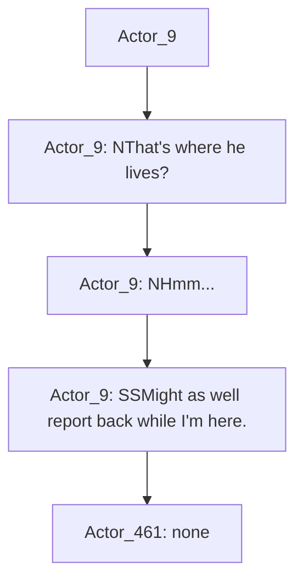

# Trachi/Central/Rondham Central/EV023

```mermaid
graph TD
    575_0["Actor_9"]
    575_1["Actor_9: NThat's where he lives?"]
    575_2["Actor_9: NHmm..."]
    575_3["Actor_9: SSMight as well report back while I'm here."]
    575_4["Actor_461: none"]
    575_0 --> 575_1
    575_1 --> 575_2
    575_2 --> 575_3
    575_3 --> 575_4
```