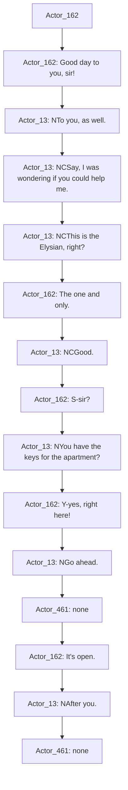

# Trachi/Central/Rondham Central/Safehouse/EV017

```mermaid
graph TD
    579_0["Actor_162"]
    579_1["Actor_162: Good day to you, sir!"]
    579_2["Actor_13: NTo you, as well."]
    579_3["Actor_13: NCSay, I was wondering if you could help me."]
    579_4["Actor_13: NCThis is the Elysian, right?"]
    579_5["Actor_162: The one and only."]
    579_6["Actor_13: NCGood."]
    579_7["Actor_162: S-sir?"]
    579_8["Actor_13: NYou have the keys for the apartment?"]
    579_9["Actor_162: Y-yes, right here!"]
    579_10["Actor_13: NGo ahead."]
    579_11["Actor_461: none"]
    579_12["Actor_162: It's open."]
    579_13["Actor_13: NAfter you."]
    579_14["Actor_461: none"]
    579_0 --> 579_1
    579_1 --> 579_2
    579_2 --> 579_3
    579_3 --> 579_4
    579_4 --> 579_5
    579_5 --> 579_6
    579_6 --> 579_7
    579_7 --> 579_8
    579_8 --> 579_9
    579_9 --> 579_10
    579_10 --> 579_11
    579_11 --> 579_12
    579_12 --> 579_13
    579_13 --> 579_14
```