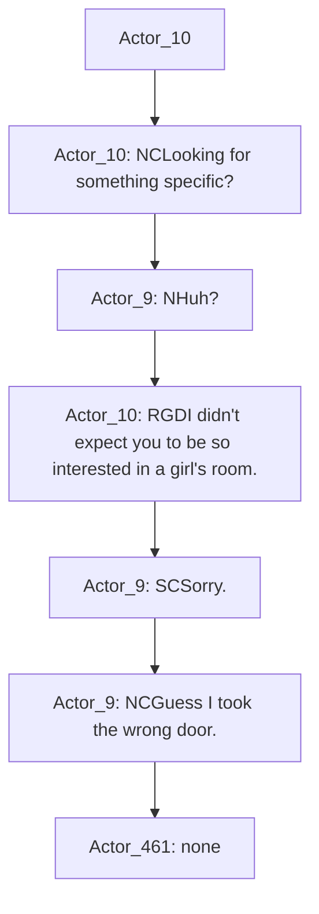

# Trachi/Central/Rondham Central/Safehouse/Loge/Bedroom Daphne/EV001

```mermaid
graph TD
    581_0["Actor_10"]
    581_1["Actor_10: NCLooking for something specific?"]
    581_2["Actor_9: NHuh?"]
    581_3["Actor_10: RGDI didn't expect you to be so interested in a girl's room."]
    581_4["Actor_9: SCSorry."]
    581_5["Actor_9: NCGuess I took the wrong door."]
    581_6["Actor_461: none"]
    581_0 --> 581_1
    581_1 --> 581_2
    581_2 --> 581_3
    581_3 --> 581_4
    581_4 --> 581_5
    581_5 --> 581_6
```