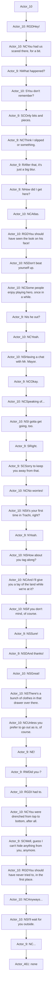

# Trachi/Central/Rondham Central/Safehouse/Loge/Bedroom Gany/Daphne SH

```mermaid
graph TD
    583_0["Actor_10"]
    583_1["Actor_10: RGDHey!"]
    583_2["Actor_10: NCYou had us scared there, for a bit."]
    583_3["Actor_9: NWhat happened?"]
    583_4["Actor_10: SYou don't remember?"]
    583_5["Actor_9: SCOnly bits and pieces."]
    583_6["Actor_9: NCThink I slipped or something."]
    583_7["Actor_9: RAfter that, it's just a big blur."]
    583_8["Actor_9: NHow did I get here?"]
    583_9["Actor_10: NCAtlas."]
    583_10["Actor_10: RGDYou should have seen the look on his face!"]
    583_11["Actor_10: NSDon't beat yourself up."]
    583_12["Actor_10: NCSome people enjoy playing hero, once in a while."]
    583_13["Actor_9: NIs he out?"]
    583_14["Actor_10: NCYeah."]
    583_15["Actor_10: NSHaving a chat with Mr. Mayor."]
    583_16["Actor_9: NCOkay."]
    583_17["Actor_10: NCSpeaking of..."]
    583_18["Actor_10: NSI gotta get going, too."]
    583_19["Actor_9: SRight."]
    583_20["Actor_9: SCSorry to keep you away from that."]
    583_21["Actor_10: NCNo worries!"]
    583_22["Actor_10: NSIt's your first time in Trachi, right?"]
    583_23["Actor_9: NYeah."]
    583_24["Actor_10: NSHow about you tag along?"]
    583_25["Actor_10: NCAnd I'll give you a lay of the land while we're at it?"]
    583_26["Actor_10: NSIf you don't mind, of course."]
    583_27["Actor_9: NSSure!"]
    583_28["Actor_9: NSDAnd thanks!"]
    583_29["Actor_10: NSGreat!"]
    583_30["Actor_10: NSThere's a bunch of clothes in that drawer over there."]
    583_31["Actor_10: NCUnless you prefer to go out as is, of course."]
    583_32["Actor_9: NE!"]
    583_33["Actor_9: RWDid you-?"]
    583_34["Actor_10: RGDI had to."]
    583_35["Actor_10: NCYou were drenched from top to bottom, after all."]
    583_36["Actor_9: SCWell, guess I can't hide anything from you, anymore."]
    583_37["Actor_10: RGDYou should have never tried to, in the first place."]
    583_38["Actor_10: NCAnyways..."]
    583_39["Actor_10: NSI'll wait for you outside."]
    583_40["Actor_9: NC..."]
    583_41["Actor_461: none"]
    583_0 --> 583_1
    583_1 --> 583_2
    583_2 --> 583_3
    583_3 --> 583_4
    583_4 --> 583_5
    583_5 --> 583_6
    583_6 --> 583_7
    583_7 --> 583_8
    583_8 --> 583_9
    583_9 --> 583_10
    583_10 --> 583_11
    583_11 --> 583_12
    583_12 --> 583_13
    583_13 --> 583_14
    583_14 --> 583_15
    583_15 --> 583_16
    583_16 --> 583_17
    583_17 --> 583_18
    583_18 --> 583_19
    583_19 --> 583_20
    583_20 --> 583_21
    583_21 --> 583_22
    583_22 --> 583_23
    583_23 --> 583_24
    583_24 --> 583_25
    583_25 --> 583_26
    583_26 --> 583_27
    583_27 --> 583_28
    583_28 --> 583_29
    583_29 --> 583_30
    583_30 --> 583_31
    583_31 --> 583_32
    583_32 --> 583_33
    583_33 --> 583_34
    583_34 --> 583_35
    583_35 --> 583_36
    583_36 --> 583_37
    583_37 --> 583_38
    583_38 --> 583_39
    583_39 --> 583_40
    583_40 --> 583_41
```