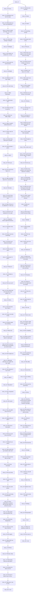

# Trachi/Central/Rondham Central/Safehouse/Loge/Daphne

```mermaid
graph TD
    585_0["Actor_13"]
    585_1["Actor_13: NI see..."]
    585_2["Actor_13: NCGetting to her won't be easy."]
    585_3["Actor_10: NWhat about our man in the parliament?"]
    585_4["Actor_13: NHe's at odds with Faber, from what I know."]
    585_5["Actor_10: NCan't they arrange a meeting?"]
    585_6["Actor_13: NCMaybe."]
    585_7["Actor_13: NI'd rather not activate him, so soon."]
    585_8["Actor_13: NLet's give him until tomorrow."]
    585_9["Actor_10: NSAlright."]
    585_10["Actor_13: NWhat's on your mind, Daph?"]
    585_11["Actor_10: SCI don't know."]
    585_12["Actor_10: NBut Ganymede..."]
    585_13["Actor_13: NWhat about him?"]
    585_14["Actor_10: NCNot sure how to say this..."]
    585_15["Actor_13: NCHe's an oddity, alright."]
    585_16["Actor_13: NBut I wouldn't underestimate him."]
    585_17["Actor_10: NHe's way too young."]
    585_18["Actor_13: NDoesn't the same go for yourself?"]
    585_19["Actor_10: NCPoint taken, I guess."]
    585_20["Actor_13: NSo?"]
    585_21["Actor_10: RCIt's just..."]
    585_22["Actor_10: NCI can't put my finger on it."]
    585_23["Actor_10: NBut something about him is seriously off."]
    585_24["Actor_13: NCListen..."]
    585_25["Actor_13: NI don't know what you're trying to do here."]
    585_26["Actor_13: NBut I'd focus on my objectives, if I were you."]
    585_27["Actor_13: NCAnd I'm not saying this for my sake."]
    585_28["Actor_13: NHyperion doesn't appreciate detours."]
    585_29["Actor_13: NCTake it from me."]
    585_30["Actor_10: NCCan I ask you something?"]
    585_31["Actor_13: NCAren't you doing that already?"]
    585_32["Actor_10: NWhy are you here?"]
    585_33["Actor_13: NBecause I'm told to."]
    585_34["Actor_10: NThat's it?"]
    585_35["Actor_13: NCSimple as that."]
    585_36["Actor_10: NAre you sure?"]
    585_37["Actor_13: NI'm doing what can to the best of my abilities, no?"]
    585_38["Actor_10: NCHm..."]
    585_39["Actor_13: NCA bit harsh, but I'll take it."]
    585_40["Actor_10: NThat's not what I mean."]
    585_41["Actor_10: NThere's gotta be something."]
    585_42["Actor_13: NSuch as?"]
    585_43["Actor_10: NCYou know what I'm referring to."]
    585_44["Actor_13: NCI'm sure he's already told you everything you need to know."]
    585_45["Actor_13: SCOr maybe not."]
    585_46["Actor_13: SBecause otherwise you wouldn't be here, right?"]
    585_47["Actor_10: NIt's because of her, isn't it?"]
    585_48["Actor_13: NWho?"]
    585_49["Actor_10: NEurydice?"]
    585_50["Actor_13: NYou recognized her."]
    585_51["Actor_10: SOf course!"]
    585_52["Actor_13: NSo why didn't you turn her in?"]
    585_53["Actor_10: NWhat tells you I didn't?"]
    585_54["Actor_13: SPCJust an assumption."]
    585_55["Actor_10: SAre you sure you can do this?"]
    585_56["Actor_13: NWhat do you mean?"]
    585_57["Actor_10: SShe used to be your handler, didn't she?"]
    585_58["Actor_10: NThat business with her sister..."]
    585_59["Actor_13: SCLong concluded."]
    585_60["Actor_13: SAs you know."]
    585_61["Actor_10: NFor you, as well?"]
    585_62["Actor_13: SPCYour point, please."]
    585_63["Actor_10: NCI'm just trying to understand..."]
    585_64["Actor_10: NYour relationship to someone who has been AWOL for almost two years."]
    585_65["Actor_13: SWe parted ways long before that."]
    585_66["Actor_10: NCUntil she disappeared."]
    585_67["Actor_10: NAnd you were sent to find her."]
    585_68["Actor_10: NCSo again..."]
    585_69["Actor_10: NWhy didn't you turn her in?"]
    585_70["Actor_13: SPCHm."]
    585_71["Actor_10: NAnswer, Atlas."]
    585_72["Actor_13: NRemember what you said earlier?"]
    585_73["Actor_13: NCAbout her sister and me?"]
    585_74["Actor_13: NCI have to keep an eye on Eury..."]
    585_75["Actor_13: NBecause I owe it to her."]
    585_76["Actor_461: none"]
    585_77["Actor_10: NSGood work out there."]
    585_78["Actor_9: NYeah."]
    585_79["Actor_10: NHm?"]
    585_80["Actor_10: SSomething wrong?"]
    585_81["Actor_9: SCAll good, don't worry."]
    585_82["Actor_9: RCIt just..."]
    585_83["Actor_9: RFeels like we're about to cross a line with what we're doing."]
    585_84["Actor_10: NCDon't know if it makes you feel any better..."]
    585_85["Actor_10: NBut it's not easy on me, either."]
    585_86["Actor_9: NSCI wasn't sure, to be honest."]
    585_87["Actor_9: NSYou always seem so confident."]
    585_88["Actor_9: NGDGot me a bit envious, to be honest!"]
    585_89["Actor_10: NCAwww..."]
    585_90["Actor_10: NSThat's how you see me?"]
    585_91["Actor_10: NCGuess I'm that good at hiding it."]
    585_92["Actor_9: NHave you ever done anything like this before?"]
    585_93["Actor_10: SCI'm afraid that's classified."]
    585_94["Actor_9: NSCThought as much."]
    585_95["Actor_9: NSo, what's next?"]
    585_96["Actor_10: NI'm gonna relay that the stage for tonight is set."]
    585_97["Actor_10: SCAs for you..."]
    585_98["Actor_10: NOne of our contacts in the Guard has asked for a meeting."]
    585_99["Actor_10: SCNormally, Atlas would handle stuff like that."]
    585_100["Actor_10: NBut he's off on some goose-chase after one of Amryn's people."]
    585_101["Actor_10: NSSo I guess you'll have to do the honours."]
    585_102["Actor_9: NWho am I meeting?"]
    585_103["Actor_10: NHis name is Arnold Francesco Solka."]
    585_104["Actor_9: NEWait!"]
    585_105["Actor_9: RWCOLONEL Solka?"]
    585_106["Actor_10: NCThe man himself."]
    585_107["Actor_9: SHe's one of our people?"]
    585_108["Actor_10: SSCSort of."]
    585_109["Actor_10: NSWe know something he doesn't want us to know."]
    585_110["Actor_10: SGCSo we do each other a little favour, here and there."]
    585_111["Actor_10: SCAnyways..."]
    585_112["Actor_10: SThere's a chance our hit tonight won't be enough."]
    585_113["Actor_10: SCIf that's the case..."]
    585_114["Actor_10: SWe'll need his troops."]
    585_115["Actor_9: SCI see."]
    585_116["Actor_10: SThere's more."]
    585_117["Actor_10: SCTanner might become a problem, down the line."]
    585_118["Actor_10: SCSo, hopefully..."]
    585_119["Actor_10: SSolka can fill in some of the gaps for us."]
    585_120["Actor_9: NWhere's the meeting taking place?"]
    585_121["Actor_10: NThe prefecture in Sigmund Plaza."]
    585_122["Actor_10: NHis office."]
    585_123["Actor_10: NSecond floor."]
    585_124["Actor_9: SYou're shitting me."]
    585_125["Actor_10: NThose are the parameters."]
    585_126["Actor_9: SCHm."]
    585_127["Actor_10: NYou'll be running under the identity of a corporal named Theodore Harrington."]
    585_128["Actor_10: NThe name's in their books, so it should stand scrutiny."]
    585_129["Actor_10: NCAnd of course..."]
    585_130["Actor_10: NSWe also got you a uniform."]
    585_131["Actor_10: NCSo as long as you're not sniffing around too much..."]
    585_132["Actor_10: NSYou'll be fine."]
    585_133["Actor_9: NCAlright."]
    585_134["Actor_9: NI'll go and get changed, then."]
    585_135["Actor_10: NSHow does it feel?"]
    585_136["Actor_9: NPCIt's a bit stiff in places."]
    585_137["Actor_9: SSBut it'll do."]
    585_138["Actor_10: NSGlad to hear it."]
    585_139["Actor_9: NI'm gonna head out, then."]
    585_140["Actor_10: NSOkay."]
    585_141["Actor_10: NCGanymede?"]
    585_142["Actor_9: NYa?"]
    585_143["Actor_10: NSDon't do anything I wouldn't do."]
    585_144["Actor_9: NCIf you say so."]
    585_145["Actor_461: none"]
    585_0 --> 585_1
    585_0 --> 585_77
    585_1 --> 585_2
    585_2 --> 585_3
    585_3 --> 585_4
    585_4 --> 585_5
    585_5 --> 585_6
    585_6 --> 585_7
    585_7 --> 585_8
    585_8 --> 585_9
    585_9 --> 585_10
    585_10 --> 585_11
    585_11 --> 585_12
    585_12 --> 585_13
    585_13 --> 585_14
    585_14 --> 585_15
    585_15 --> 585_16
    585_16 --> 585_17
    585_17 --> 585_18
    585_18 --> 585_19
    585_19 --> 585_20
    585_20 --> 585_21
    585_21 --> 585_22
    585_22 --> 585_23
    585_23 --> 585_24
    585_24 --> 585_25
    585_25 --> 585_26
    585_26 --> 585_27
    585_27 --> 585_28
    585_28 --> 585_29
    585_29 --> 585_30
    585_30 --> 585_31
    585_31 --> 585_32
    585_32 --> 585_33
    585_33 --> 585_34
    585_34 --> 585_35
    585_35 --> 585_36
    585_36 --> 585_37
    585_37 --> 585_38
    585_38 --> 585_39
    585_39 --> 585_40
    585_40 --> 585_41
    585_41 --> 585_42
    585_42 --> 585_43
    585_43 --> 585_44
    585_44 --> 585_45
    585_45 --> 585_46
    585_46 --> 585_47
    585_47 --> 585_48
    585_48 --> 585_49
    585_49 --> 585_50
    585_50 --> 585_51
    585_51 --> 585_52
    585_52 --> 585_53
    585_53 --> 585_54
    585_54 --> 585_55
    585_55 --> 585_56
    585_56 --> 585_57
    585_57 --> 585_58
    585_58 --> 585_59
    585_59 --> 585_60
    585_60 --> 585_61
    585_61 --> 585_62
    585_62 --> 585_63
    585_63 --> 585_64
    585_64 --> 585_65
    585_65 --> 585_66
    585_66 --> 585_67
    585_67 --> 585_68
    585_68 --> 585_69
    585_69 --> 585_70
    585_70 --> 585_71
    585_71 --> 585_72
    585_72 --> 585_73
    585_73 --> 585_74
    585_74 --> 585_75
    585_75 --> 585_76
    585_77 --> 585_78
    585_78 --> 585_79
    585_79 --> 585_80
    585_80 --> 585_81
    585_81 --> 585_82
    585_82 --> 585_83
    585_83 --> 585_84
    585_84 --> 585_85
    585_85 --> 585_86
    585_86 --> 585_87
    585_87 --> 585_88
    585_88 --> 585_89
    585_89 --> 585_90
    585_90 --> 585_91
    585_91 --> 585_92
    585_92 --> 585_93
    585_93 --> 585_94
    585_94 --> 585_95
    585_95 --> 585_96
    585_96 --> 585_97
    585_97 --> 585_98
    585_98 --> 585_99
    585_99 --> 585_100
    585_100 --> 585_101
    585_101 --> 585_102
    585_102 --> 585_103
    585_103 --> 585_104
    585_104 --> 585_105
    585_105 --> 585_106
    585_106 --> 585_107
    585_107 --> 585_108
    585_108 --> 585_109
    585_109 --> 585_110
    585_110 --> 585_111
    585_111 --> 585_112
    585_112 --> 585_113
    585_113 --> 585_114
    585_114 --> 585_115
    585_115 --> 585_116
    585_116 --> 585_117
    585_117 --> 585_118
    585_118 --> 585_119
    585_119 --> 585_120
    585_120 --> 585_121
    585_121 --> 585_122
    585_122 --> 585_123
    585_123 --> 585_124
    585_124 --> 585_125
    585_125 --> 585_126
    585_126 --> 585_127
    585_127 --> 585_128
    585_128 --> 585_129
    585_129 --> 585_130
    585_130 --> 585_131
    585_131 --> 585_132
    585_132 --> 585_133
    585_133 --> 585_134
    585_134 --> 585_135
    585_135 --> 585_136
    585_136 --> 585_137
    585_137 --> 585_138
    585_138 --> 585_139
    585_139 --> 585_140
    585_140 --> 585_141
    585_141 --> 585_142
    585_142 --> 585_143
    585_143 --> 585_144
    585_144 --> 585_145
```