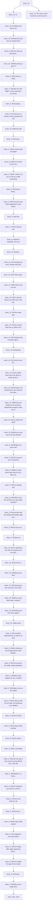

# Trachi/Central/Rondham Central/Safehouse/Loge/EV004

```mermaid
graph TD
    587_0["Actor_10"]
    587_1["Actor_10: N..."]
    587_2["Actor_10: SCWhere the hell is he?"]
    587_3["Actor_10: SPWhat the fuck are you doing here?"]
    587_4["Actor_5: NSCYou still use this place..."]
    587_5["Actor_10: SNEHow did you get in?"]
    587_6["Actor_5: NSIt's been a while."]
    587_7["Actor_5: NSCBut me and Ralph, we go way back, you know."]
    587_8["Actor_5: NCAnyways..."]
    587_9["Actor_5: NI need you to answer a few questions for me."]
    587_10["Actor_10: SNELike hell!"]
    587_11["Actor_5: NSCAww..."]
    587_12["Actor_5: NSNo need to get all uppity!"]
    587_13["Actor_5: NSDI'm not here to hurt you."]
    587_14["Actor_5: NSAll I need is for you to tell me a little something."]
    587_15["Actor_5: NSCAnd in return..."]
    587_16["Actor_5: NSI'll let you know what happened to your friend."]
    587_17["Actor_5: NSCYes."]
    587_18["Actor_5: NSThe blonde one."]
    587_19["Actor_5: NSDHe's adorable, isn't he?"]
    587_20["Actor_10: SCEury..."]
    587_21["Actor_10: NSI thought you were smarter than this."]
    587_22["Actor_10: SSCThat's right..."]
    587_23["Actor_10: SMEI know who you are."]
    587_24["Actor_10: SSCI read all about your little trip to this city..."]
    587_25["Actor_10: NSTwo years ago."]
    587_26["Actor_10: NSYou fucked that one up, didn't you?"]
    587_27["Actor_10: SGCSeduced by a double agent..."]
    587_28["Actor_10: NSPathetic."]
    587_29["Actor_10: SSCAnd to top it off..."]
    587_30["Actor_10: NSYou didn't even have the spine to stand up for it."]
    587_31["Actor_10: SSCInstead, you crawled from one shack to the other."]
    587_32["Actor_10: SMEUntil you finally found someone desperate enough to take you in."]
    587_33["Actor_10: NCSo what's the deal?"]
    587_34["Actor_10: NSDid you suck your host dry already?"]
    587_35["Actor_5: NSDBright one, aren't we?"]
    587_36["Actor_5: NSCSo proud of your homework!"]
    587_37["Actor_5: NSBut I've got some bad news for you, little one."]
    587_38["Actor_5: NSYou already lost."]
    587_39["Actor_5: NSCWhen was the last time you saw Atlas, I wonder?"]
    587_40["Actor_5: NCAnd with that boy being interrogated right now..."]
    587_41["Actor_5: NSCIt's just you..."]
    587_42["Actor_5: NSAnd me."]
    587_43["Actor_10: NCI'm starting to see why he respects you so much."]
    587_44["Actor_10: NCSo tell me..."]
    587_45["Actor_10: NSWhat was it like?"]
    587_46["Actor_10: SSCSeeing the man you fell in love with..."]
    587_47["Actor_10: SMEFuck your little sister, instead?"]
    587_48["Actor_10: SSCWhat was her name again?"]
    587_49["Actor_10: SMELorna?"]
    587_50["Actor_5: SPI would've expected you to hold on to that."]
    587_51["Actor_5: SGBut seeing as you're playing that card, already..."]
    587_52["Actor_5: RGYou've got to be really, really desperate."]
    587_53["Actor_5: NSWhen did it happen for you, exactly?"]
    587_54["Actor_5: NSCWas it love at first sight?"]
    587_55["Actor_5: RGOr did you fall for him after he butchered your daddy?"]
    587_56["Actor_5: SGPoor Daniil."]
    587_57["Actor_5: RGAnd poor little Dorothy."]
    587_58["Actor_5: NSCSo alone."]
    587_59["Actor_5: NSSo vulnerable."]
    587_60["Actor_5: NSUntil one day a man came by and offered her a new life."]
    587_61["Actor_5: NSHyperion, or Teron..."]
    587_62["Actor_5: NSCOr whatever you want to call him."]
    587_63["Actor_5: NSThe man behind it all."]
    587_64["Actor_5: SGAnd you..."]
    587_65["Actor_5: RGHis loyal, little puppy!"]
    587_66["Actor_5: NSLonging for your big reward."]
    587_67["Actor_5: NSCTo finally, after eight agonizing years..."]
    587_68["Actor_5: NSPut a bullet through Áron's head."]
    587_69["Actor_5: SGThat's..."]
    587_70["Actor_5: RGWhy you're really here."]
    587_71["Actor_461: none"]
    587_72["Actor_13: NCI have some business to take care of."]
    587_0 --> 587_1
    587_0 --> 587_72
    587_1 --> 587_2
    587_2 --> 587_3
    587_3 --> 587_4
    587_4 --> 587_5
    587_5 --> 587_6
    587_6 --> 587_7
    587_7 --> 587_8
    587_8 --> 587_9
    587_9 --> 587_10
    587_10 --> 587_11
    587_11 --> 587_12
    587_12 --> 587_13
    587_13 --> 587_14
    587_14 --> 587_15
    587_15 --> 587_16
    587_16 --> 587_17
    587_17 --> 587_18
    587_18 --> 587_19
    587_19 --> 587_20
    587_20 --> 587_21
    587_21 --> 587_22
    587_22 --> 587_23
    587_23 --> 587_24
    587_24 --> 587_25
    587_25 --> 587_26
    587_26 --> 587_27
    587_27 --> 587_28
    587_28 --> 587_29
    587_29 --> 587_30
    587_30 --> 587_31
    587_31 --> 587_32
    587_32 --> 587_33
    587_33 --> 587_34
    587_34 --> 587_35
    587_35 --> 587_36
    587_36 --> 587_37
    587_37 --> 587_38
    587_38 --> 587_39
    587_39 --> 587_40
    587_40 --> 587_41
    587_41 --> 587_42
    587_42 --> 587_43
    587_43 --> 587_44
    587_44 --> 587_45
    587_45 --> 587_46
    587_46 --> 587_47
    587_47 --> 587_48
    587_48 --> 587_49
    587_49 --> 587_50
    587_50 --> 587_51
    587_51 --> 587_52
    587_52 --> 587_53
    587_53 --> 587_54
    587_54 --> 587_55
    587_55 --> 587_56
    587_56 --> 587_57
    587_57 --> 587_58
    587_58 --> 587_59
    587_59 --> 587_60
    587_60 --> 587_61
    587_61 --> 587_62
    587_62 --> 587_63
    587_63 --> 587_64
    587_64 --> 587_65
    587_65 --> 587_66
    587_66 --> 587_67
    587_67 --> 587_68
    587_68 --> 587_69
    587_69 --> 587_70
    587_70 --> 587_71
```