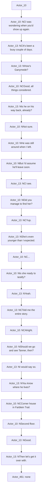

# Trachi/Central/Rondham Central/Safehouse/Loge/EV007

```mermaid
graph TD
    588_0["Actor_10"]
    588_1["Actor_10: NCI was wondering when you'd show up again."]
    588_2["Actor_13: NCIt's been a busy couple of days."]
    588_3["Actor_13: NHow's Ganymede?"]
    588_4["Actor_10: NCGood, all things considered."]
    588_5["Actor_13: NIs he on his way back, already?"]
    588_6["Actor_10: NNot sure."]
    588_7["Actor_10: NHe was still around when I left."]
    588_8["Actor_10: NBut I'd assume he'll leave soon."]
    588_9["Actor_13: NCI see."]
    588_10["Actor_10: NDid you manage to find her?"]
    588_11["Actor_13: NCYup."]
    588_12["Actor_13: NShe's even younger than I expected."]
    588_13["Actor_10: NC..."]
    588_14["Actor_10: NIs she ready to testify?"]
    588_15["Actor_13: NYeah."]
    588_16["Actor_13: NCTold me the entire story."]
    588_17["Actor_10: NCAlright."]
    588_18["Actor_10: NShould we go and see Tanner, then?"]
    588_19["Actor_13: NI would say so."]
    588_20["Actor_13: NYou know where he lives?"]
    588_21["Actor_10: NCCorner house in Farblein Trail."]
    588_22["Actor_10: NSecond floor."]
    588_23["Actor_13: NGood."]
    588_24["Actor_13: NThen let's get it over with."]
    588_25["Actor_461: none"]
    588_0 --> 588_1
    588_1 --> 588_2
    588_2 --> 588_3
    588_3 --> 588_4
    588_4 --> 588_5
    588_5 --> 588_6
    588_6 --> 588_7
    588_7 --> 588_8
    588_8 --> 588_9
    588_9 --> 588_10
    588_10 --> 588_11
    588_11 --> 588_12
    588_12 --> 588_13
    588_13 --> 588_14
    588_14 --> 588_15
    588_15 --> 588_16
    588_16 --> 588_17
    588_17 --> 588_18
    588_18 --> 588_19
    588_19 --> 588_20
    588_20 --> 588_21
    588_21 --> 588_22
    588_22 --> 588_23
    588_23 --> 588_24
    588_24 --> 588_25
```