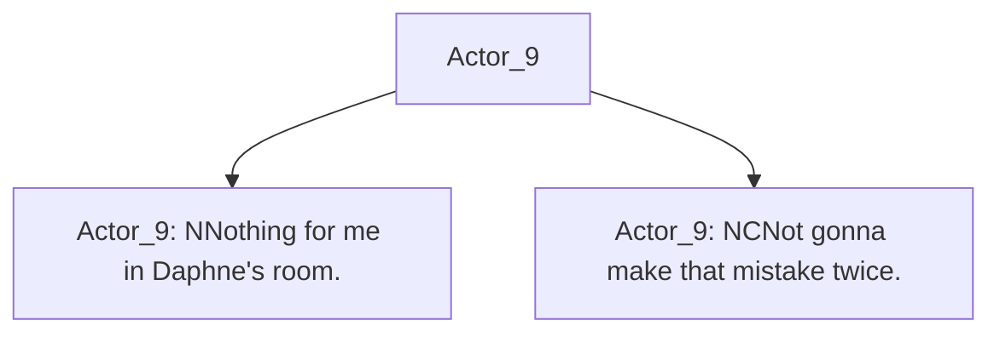

# Trachi/Central/Rondham Central/Safehouse/Loge/EV015

```mermaid
graph TD
    590_0["Actor_9"]
    590_1["Actor_9: NNothing for me in Daphne's room."]
    590_3["Actor_9: NCNot gonna make that mistake twice."]
    590_0 --> 590_1
    590_0 --> 590_3
```