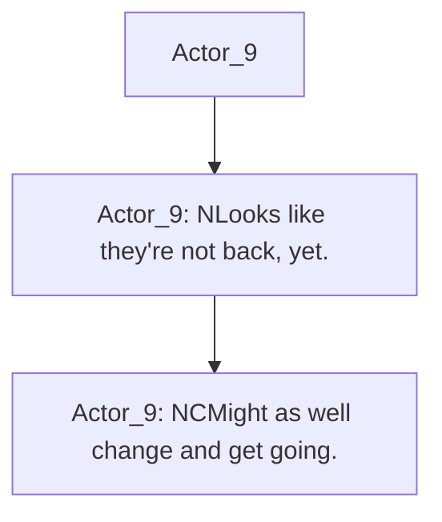

# Trachi/Central/Rondham Central/Safehouse/Loge/EV020

```mermaid
graph TD
    591_0["Actor_9"]
    591_1["Actor_9: NLooks like they're not back, yet."]
    591_2["Actor_9: NCMight as well change and get going."]
    591_0 --> 591_1
    591_1 --> 591_2
```