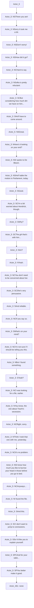

# Trachi/Central/Rondham Central/Safehouse/Loge/EV027

```mermaid
graph TD
    593_0["Actor_5"]
    593_1["Actor_5: NSThere you are!"]
    593_2["Actor_3: NSorry it took me a bit."]
    593_3["Actor_5: NSDon't worry!"]
    593_4["Actor_5: NSHow did it go?"]
    593_5["Actor_3: NCHard to say."]
    593_6["Actor_3: NSolka is pretty reluctant."]
    593_7["Actor_3: SCBut considering how much dirt we have on him..."]
    593_8["Actor_3: SHe'll have to come around."]
    593_9["Actor_5: NSGreat."]
    593_10["Actor_3: NHow's it looking on your end?"]
    593_11["Actor_5: NSI spoke to De Bloom."]
    593_12["Actor_5: NSHe'll table the motion in Parliament, today."]
    593_13["Actor_3: SGood."]
    593_14["Actor_5: SCI'm a bit worried about Hendrick, though."]
    593_15["Actor_3: SWhy?"]
    593_16["Actor_5: SCThe girl that's with him..."]
    593_17["Actor_3: NAri?"]
    593_18["Actor_5: NYeah."]
    593_19["Actor_3: NCYou don't need to be concerned about her."]
    593_20["Actor_3: SCShe's very persuasive."]
    593_21["Actor_3: SAnd reliable."]
    593_22["Actor_5: NCIf you say so."]
    593_23["Actor_3: SWhat's on your mind?"]
    593_24["Actor_5: NCI'm not sure if I should be telling you this."]
    593_25["Actor_5: NBut I found something."]
    593_26["Actor_3: SYeah?"]
    593_27["Actor_5: NCI was looking for a file, earlier."]
    593_28["Actor_5: NYou know, the one about Trachi's secession."]
    593_29["Actor_3: NCRight, sorry."]
    593_30["Actor_3: NThink I took that one with me, yesterday."]
    593_31["Actor_5: NCIt's no problem."]
    593_32["Actor_5: NSI know how much you like to burrow your head in those before you go to bed."]
    593_33["Actor_5: NCAnyways..."]
    593_34["Actor_5: NI found the file."]
    593_35["Actor_5: SAnd this."]
    593_36["Actor_5: SCI don't want to jump to conclusions."]
    593_37["Actor_5: SSo I'd like you to explain yourself."]
    593_38["Actor_5: SPCAnd for your sake..."]
    593_39["Actor_5: SPYou better make it good."]
    593_40["Actor_461: none"]
    593_0 --> 593_1
    593_1 --> 593_2
    593_2 --> 593_3
    593_3 --> 593_4
    593_4 --> 593_5
    593_5 --> 593_6
    593_6 --> 593_7
    593_7 --> 593_8
    593_8 --> 593_9
    593_9 --> 593_10
    593_10 --> 593_11
    593_11 --> 593_12
    593_12 --> 593_13
    593_13 --> 593_14
    593_14 --> 593_15
    593_15 --> 593_16
    593_16 --> 593_17
    593_17 --> 593_18
    593_18 --> 593_19
    593_19 --> 593_20
    593_20 --> 593_21
    593_21 --> 593_22
    593_22 --> 593_23
    593_23 --> 593_24
    593_24 --> 593_25
    593_25 --> 593_26
    593_26 --> 593_27
    593_27 --> 593_28
    593_28 --> 593_29
    593_29 --> 593_30
    593_30 --> 593_31
    593_31 --> 593_32
    593_32 --> 593_33
    593_33 --> 593_34
    593_34 --> 593_35
    593_35 --> 593_36
    593_36 --> 593_37
    593_37 --> 593_38
    593_38 --> 593_39
    593_39 --> 593_40
```