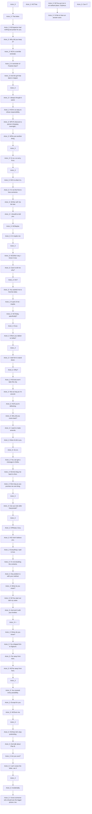

# Trachi/Central/Rondham Central/Safehouse/Loge/InterrogAtion

```mermaid
graph TD
    781_0["Actor_9"]
    781_1["Actor_5: That letter."]
    781_2["Actor_3: NCHyperion had nothing but praise for you."]
    781_3["Actor_5: Why did you keep it?"]
    781_4["Actor_3: NCIt's a terrible reminder."]
    781_5["Actor_5: A reminder of Fredrick Dam?"]
    781_6["Actor_3: NCThat."]
    781_7["Actor_3: And the girl that died in Calpoli."]
    781_8["Actor_5"]
    781_9["Actor_3: I always thought it weird."]
    781_10["Actor_3: NCIt's so easy to refuse responsibility."]
    781_11["Actor_3: NPCTo discount a person changing overnight..."]
    781_12["Actor_3: NPAs just another thing."]
    781_13["Actor_5"]
    781_14["Actor_3: I'm so, so sorry, Eury."]
    781_15["Actor_3"]
    781_16["Actor_5: NCIt is what it is."]
    781_17["Actor_5: I'm not the first to lose someone."]
    781_18["Actor_5: NCNor will I be the last."]
    781_19["Actor_3: I should've told you."]
    781_20["Actor_5: NCMaybe."]
    781_21["Actor_5: Or maybe not."]
    781_22["Actor_5"]
    781_23["Actor_5: NCEither way, I know it now."]
    781_24["Actor_5: Care to tell me why?"]
    781_25["Actor_3: Hm?"]
    781_27["Actor_5: You wanted me to find the letter."]
    781_28["Actor_3: A part of me - maybe."]
    781_29["Actor_5: NCToday, specifically?"]
    781_30["Actor_3: Eury-"]
    781_31["Actor_5: When you talked to Solka?"]
    781_32["Actor_3"]
    781_33["Actor_5: NCYou put me in an awkard place, Orpheus."]
    781_34["Actor_5: I'd like to hear an answer soon."]
    781_35["Actor_3: I told him to stand down."]
    781_36["Actor_5: Why?"]
    781_37["Actor_3: NCIonia won't take this city."]
    781_38["Actor_5: NCIf you're defecting-"]
    781_39["Actor_3: You can get a message to Solka."]
    781_40["Actor_3: NCAnd drag me back to AIon."]
    781_41["Actor_3: NAs long as you promise me one thing."]
    781_42["Actor_5"]
    781_43["Actor_3: Can you look after Ganymede?"]
    781_45["Actor_5"]
    781_46["Actor_3: Not as long as I'm around."]
    781_47["Actor_5: Why did you come back?"]
    781_48["Actor_3: I want to make amends."]
    781_49["Actor_3: Most of all to you."]
    781_50["Actor_5: Go on."]
    781_51["Actor_3: NPlease, Eury."]
    781_52["Actor_5: NCI don't believe you."]
    781_53["Actor_3: Everything I said is true."]
    781_54["Actor_5: I'm not doubting the contents."]
    781_55["Actor_5: My problem is with your method."]
    781_56["Actor_3: What do you mean?"]
    781_57["Actor_5: NCYou start out with my sister."]
    781_58["Actor_5: And end it with your brother."]
    781_59["Actor_3: I-"]
    781_60["Actor_3: SHow do you know?"]
    781_62["Actor_5: You shipped him to Siginum."]
    781_63["Actor_5: Far away from Aion."]
    781_64["Actor_5: NCFar away from here."]
    781_65["Actor_5: You covered every possibility."]
    781_66["Actor_3: Except for you."]
    781_67["Actor_3"]
    781_68["Actor_5: NCEven me."]
    781_70["Actor_5: NCNow let's stop pretending."]
    781_71["Actor_5: And talk about Plan B."]
    781_72["Actor_3: Are you sure?"]
    781_73["Actor_5: I can't unsee the letter, can I/"]
    781_74["Actor_5: Can I?"]
    781_75["Actor_3"]
    781_76["Actor_3"]
    781_77["Actor_5: Incidentally."]
    781_78["Actor_5: I know someone who should see the bigger picture, too."]
    781_0 --> 781_1
    781_1 --> 781_2
    781_2 --> 781_3
    781_3 --> 781_4
    781_4 --> 781_5
    781_5 --> 781_7
    781_7 --> 781_8
    781_8 --> 781_9
    781_9 --> 781_10
    781_10 --> 781_11
    781_11 --> 781_12
    781_12 --> 781_13
    781_13 --> 781_14
    781_14 --> 781_15
    781_15 --> 781_16
    781_16 --> 781_17
    781_17 --> 781_18
    781_18 --> 781_19
    781_19 --> 781_20
    781_20 --> 781_21
    781_21 --> 781_22
    781_22 --> 781_23
    781_23 --> 781_24
    781_24 --> 781_25
    781_25 --> 781_27
    781_27 --> 781_28
    781_28 --> 781_29
    781_29 --> 781_30
    781_30 --> 781_31
    781_31 --> 781_32
    781_32 --> 781_35
    781_33 --> 781_34
    781_35 --> 781_36
    781_36 --> 781_37
    781_37 --> 781_46
    781_38 --> 781_47
    781_39 --> 781_40
    781_40 --> 781_41
    781_41 --> 781_42
    781_42 --> 781_43
    781_43 --> 781_45
    781_45 --> 781_51
    781_46 --> 781_38
    781_47 --> 781_48
    781_48 --> 781_49
    781_49 --> 781_50
    781_50 --> 781_39
    781_51 --> 781_52
    781_52 --> 781_53
    781_53 --> 781_54
    781_54 --> 781_55
    781_55 --> 781_56
    781_56 --> 781_57
    781_57 --> 781_58
    781_58 --> 781_59
    781_59 --> 781_60
    781_60 --> 781_62
    781_62 --> 781_63
    781_63 --> 781_64
    781_64 --> 781_67
    781_65 --> 781_66
    781_66 --> 781_68
    781_67 --> 781_65
    781_68 --> 781_76
    781_70 --> 781_71
    781_71 --> 781_72
    781_72 --> 781_73
    781_73 --> 781_75
    781_75 --> 781_77
    781_76 --> 781_70
    781_77 --> 781_78
```