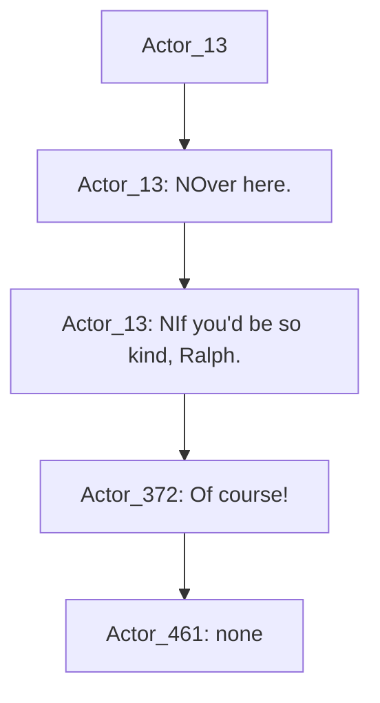

# Trachi/Central/Rondham Central/Safehouse/Ralph

```mermaid
graph TD
    596_0["Actor_13"]
    596_1["Actor_13: NOver here."]
    596_2["Actor_13: NIf you'd be so kind, Ralph."]
    596_3["Actor_372: Of course!"]
    596_4["Actor_461: none"]
    596_0 --> 596_1
    596_1 --> 596_2
    596_2 --> 596_3
    596_3 --> 596_4
```